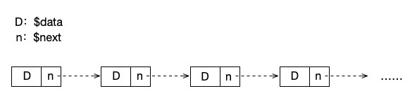

# 线性表？顺序表？链表？别再傻傻分不清楚

遵从所有教材以及种类数据结构相关的书书籍，我们先从线性表开始入门。今天这篇文章更偏概念，是关于有线性表的一个知识点的汇总。

上文说过，物理结构是用于确定数据以何种方式存储的。其他的数据结构（树、图）、算法等基本都是建立在这样一个物理结构之上的，也可以说，物理结构就是数据结构的根本。在这里，我们先介绍两个物理结构，也是我们将来学习数据结构的基石，它们就是顺序表和链表。

## 顺序表

不扯复杂的定义，不扯什么数学表达式，我们最直观的理解，顺序表就是数组。

是不是非常简单，没错，在 PHP 或者 C 的世界中，我们就把顺序表定义为数组，而相同的名词还包括：顺序存储、顺序结构等。只要看到这种名词，马上想到数组就可以了。当然，在 Java 中，我们也可以将 List 这类的集合当成是顺序存储结构。不需要需要注意的是，Java 的 HashMap ，PHP 中以键值对形式定义的数组，它们是哈希表（Hash）从形式上来说，他们并不是顺序的。在这里我们一定要记住，像数组下标递增这样顺序结构的才是顺序存储结构。

顺序表一般占用连续的内存空间。不仅逻辑上，连物理空间上都是相邻连续的。

## 链表

链表一般在 C 中会定义为一个结构体，其中包括数据和指向下一个链表的指针，它不是顺序的，虽然逻辑是有顺序的（按指针指向），但在物理是可以分开的。也就是说，链表不用占用连续的内存空间，不需要在初始化的时候像数组一样给定长度。

在 PHP 中，我们没有结构体这种语法形式，所以我们直接使用类来表示链表结构。

```php

class Node{
    public $data;
    public Node $next;
}

```

这就是一个简单的链表结构，我们可以把它叫做一个“结点”。$data 中存放我们要保存的数据，可以是做任意类型。而 $next 则是我们下一个链表结点。如果我们需要简单的遍历链表，直接不停的调用 $next 直到它为空即可。

```php

while($n->next){
    $n = $n->next;
    echo $n->data, PHP_EOL;
}

```



上图就是关于链表的逻辑状态以及它的遍历方向。具体的链表操作相关函数我们将在后面的文章中进行讲解。

链表有很多种形式，上面我们定义的是一个简单的单向链表。我们还可以定义双向链表（加一个 $prev 指向上一个结点），循环链表（最后一个$next指回第一个结点）以及双向循环链表（最后一个$next指回第一个结点，第一个的 $prev 指向最后一个结点）。关于这些内容，我们也会放到后面的文章中一一讲解。

## 线性表

了解了顺序表和链表之后，我们最后就来说说线性表。

其实，顺序表和链表这两种物理结构在默认状态下所实现的就是“顺序表”这个逻辑数据结构。

*顺序表：由n(n>0)个数据特性相同的元素构成的有限序列*（严蔚敏版）

注意几个关键点：

- 有限：数组长度、链表内存大小

- 序列：逻辑有序（数组是逻辑和物理都有序，链表是逻辑有序而物理无序）

- 数据特性相同：PHP 中不明显，C 或 Java 中数组是固定类型的，而且也要给一个初始长度

为什么说线性表这么重要呢？我们想想 MySQL 这样一行一行存储数据的关系型数据库，一张数据表不就是一个线性表吗？特别是我们做 PHP 的程序员，天天都是在和数组打交道（当然，我们用哈希可能更多些），也就是说，我们在做开发的时候，天天都在接触这个东西，你说它重要不重要。

而 树 和 图 这些数据结构却并不是线性表，在现实的归类中，它们是属于 非线性表 的范畴的。线性表在个很大的特点是只有前后关系，不管是链表还是数组，它们都是遵循着这种前后关系的，但是在 树 和 图 中，除了前后之外，还有上下左右等更复杂的关系。虽说它们的基本表现形式依然是使用数组和链表，但是从严格的角度来说，或者从考试面试的角度来说，它们真的不属于线性结构，而应该划分到 非线性结构 中。

## 总结

今天这篇文章是学习数据结构中基础的基础。当然，有条件的最好还是看看 C 用结构体是如何定义数组、链表的，PHP 在底层已经帮我们解决了太多问题，所以这些原始的语法结构我们已经用不到了。能够用 C 来学习数据结构是更加推荐的形式。

下一篇文章我们将介绍的是顺序表（数组）的线性表相关逻辑操作。

参考资料：

《数据结构》第二版，严蔚敏

《数据结构》第二版，陈越

《数据结构高分笔记》2020版，天勤考研

