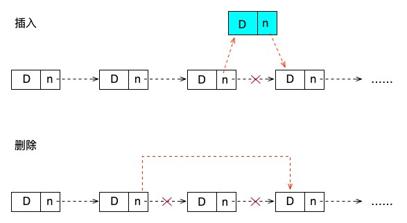

# 链表的相关逻辑操作

链表的操作相对顺序表（数组）来说就复杂了许多。因为 PHP 确实已经为我们解决了很多数组操作上的问题，所以我们可以很方便的操作数组，也就不用为数组定义很多的逻辑操作。比如在 C 中，数组是有长度限制的，而在 PHP 中我们就不会考虑这个问题。如果是使用 C 的话，这个长度限制就是数组结构的一大劣势，而链表，不管是在 C 还是在 PHP 中，都不会受到长度问题的限制。能够限制链表的只有内存的大小。另外，链表的链式结构也能够为我们带来一种全新的不同于数组操作的体验，对某些功能算法来说，链表也更有优势。

话不多说，直接来进入今天的内容吧！

## 链式结构的定义

首先，在之前的关于线性表的第一篇文章中我们就说过链表的定义，在这里，我们再复习一下之前的那个关于链表的图来更清晰的理解链表的概念。


我们将图中的节点 Node 用类来表示：

```php
/**
 * 链表结构
 */
class LinkedList
{
    public $data;
    public $next;
}
```

一个链表类就看可以看做是链表中的一个节点，它包含两个内容，data 表示数据，next 表示下一个节点的指针。就像链条一样一环套一环，这就是传说中的链表结构。

## 生成链表及初始化操作

```php
/**
 * 生成链表
 */
function createLinkedList()
{
    $list = new LinkedList();
    $list->data = null;
    $list->next = null;
    return $list;
}

/**
 * 初始化链表
 * @param array $data 链表中要保存的数据，这里以数组为参考
 * @return LinkedList 链表数据
 */
function Init(array $data)
{
    // 初始化
    $list = createLinkedList();
    $r = $list;
    foreach ($data as $key => $value) {
        $link = new LinkedList();
        $link->data = $value;
        $link->next = null;
        $r->next = $link;
        $r = $link;
    }
    return $list;
}

$link = Init(range(1, 10));

print_r($link);
// LinkedList Object
// (
//     [data] =>
//     [next] => LinkedList Object
//         (
//             [data] => 1
//             [next] => LinkedList Object
//                 (
//                     [data] => 2
//                     [next] => LinkedList Object
//                         (
//                             [data] => 3
//                             [next] => LinkedList Object
//                                 (
//                                     [data] => 4
//                                     [next] => LinkedList Object
//                                         (
//                                             [data] => 5
//                                             [next] => LinkedList Object
//                                                 (
//                                                     [data] => 6
//                                                     [next] => LinkedList Object
//                                                         (
//                                                             [data] => 7
//                                                             [next] => LinkedList Object
//                                                                 (
//                                                                     [data] => 8
//                                                                     [next] => LinkedList Object
//                                                                         (
//                                                                             [data] => 9
//                                                                             [next] => LinkedList Object
//                                                                                 (
//                                                                                     [data] => 10
//                                                                                     [next] =>
//                                                                                 )

//                                                                         )

//                                                                 )

//                                                         )

//                                                 )

//                                         )

//                                 )

//                         )

//                 )

//         )

// )
```

在使用链表的时候，我们一般会让第一个结点不包含任何数据，仅仅是做为一个空的结点来指向第一个有数据的结点。这种结点我们可以称之为头结点，如果需要判断链表是否为空的话，只需要判断第一个结点的 next 是否为空就可以了。在上面的代码中，创建链表 createLinkedList() 函数其实就是生成了这样一个头结点。

然后，我们通过 Init() 初始化函数来构造这个链表。构造过程还是比较简单的，这里我们是固定的传递进来一个数组，按照这个数组结构来构造这个链表，当然，在实际应用中，我们可以使用任何数据来构造链表。构造过程也并不复杂，将当前结点赋值给 r 变量，然后创建一个新结点，让 r->next 等于这个新创建的节点就可以了。构造好的链表直接打印出来的结构就是注释中的形式。

## 遍历链表

```php
function IteratorLinkedList(LinkedList $link)
{
    while (($link = $link->next) != null) {
        echo $link->data, ',';
    }
    echo PHP_EOL;
}
```

链表的遍历是不是非常像某些数据库的游标操作，或者像迭代器模式的操作一样。没错，其实游标和迭代器的结构就是链表的一种表现形式。我们不停的寻找 $next 直到没有下一个结点为止，这样就完成了一次链表的遍历。可以看出，这个过程的时间复杂度是 O(n) 。

## 插入、删除

```php
/**
 * 链表指定位置插入元素
 * @param LinkedList $list 链表数据
 * @param int $i 位置
 * @param mixed $data 数据
 */
function Insert(LinkedList &$list, int $i, $data)
{
    $j = 0;
    $item = $list;
    // 遍历链表，找指定位置的前一个位置
    while ($j < $i - 1) {
        $item = $item->next;
        $j++;
    }

    // 如果 item 不存在或者 $i > n+1 或者 $i < 0
    if ($item == null || $j > $i - 1) {
        return false;
    }

    // 创建一个新节点
    $s = new LinkedList();
    $s->data = $data;

    // 新创建节点的下一个节点指向原 i-1 节点的下一跳节点，也就是当前的 i 节点
    $s->next = $item->next;
    // 将 i-1 节点的下一跳节点指向 s ，完成将 s 插入指定的 i 位置，并让原来的 i 位置元素变成 i+1 位置
    $item->next = $s;

    return true;
}

/**
 * 删除链表指定位置元素
 * @param LinkedList $list 链表数据
 * @param int $i 位置
 */
function Delete(LinkedList &$list, int $i)
{
    $j = 0;
    $item = $list;
    // 遍历链表，找指定位置的前一个位置
    while ($j < $i - 1) {
        $item = $item->next;
        $j++;
    }
    // 如果 item 不存在或者 $i > n+1 或者 $i < 0
    if ($item == null || $j > $i - 1) {
        return false;
    }

    // 使用一个临时节点保存当前节点信息，$item 是第 i-1 个节点，所以 $item->next 就是我们要找到的当前这个 i 节点
    $temp = $item->next;
    // 让当前节点，也就是目标节点的上一个节点， i-1 的这个节点的下一跳（原来的 i 位置的节点）变成原来 i 位置节点的下一跳 next 节点，让i位置的节点脱离链条
    $item->next = $temp->next;

    return true;
}

// 插入
Insert($link, 5, 55);
// 遍历链表
IteratorLinkedList($link); // 1,2,3,4,55,5,6,7,8,9,10,

// 删除
Delete($link, 7);
// 遍历链表
IteratorLinkedList($link); // 1,2,3,4,55,5,7,8,9,10,
```

链表的插入和删除其实很类似，都是需要寻找到插入或删除位置的前一个元素，也就是第 i-1 这个位置的元素。然后通过对这个元素的 next 指针的操作来实现链表元素的插入删除操作。它们在遍历和位置判断这两个功能中的代码其实都是一样的，不同的是创建时要新创建一个结点，然后让这个结点的 next 指向之前 i-1 位置元素的 next ，再将 i-1 位置元素的 next 指向新创建的这个结点。而删除操作则是保存要删除这个位置 i 的结点到一个临时变量中，然后将 i-1 位置元素的 next 指向删除位置 i 的 next 。

上面的解释需要结合代码一步一步来看，当然，我们也可以结合下面的这个图来学习。插入和删除操作是链表操作的核心，也是最复杂的部分，需要多多理解掌握。



## 根据位置查找、根据数据查找

```php
/**
 * 根据位置查找元素位置
 * @param LinkedList $list 链表数据
 * @param int $i 位置
 */
function GetElem(LinkedList &$list, int $i)
{
    $item = $list;
    $j = 1; // 从第一个开始查找，0是头结点 
    while ($item && $j <= $i) {
        $item = $item->next;
        $j++;
    }

    if (!$item || $j > $i + 1) {
        return false;
    }
    return $item->data;

}

/**
 * 根据数据查找数据元素所在位置
 * @param LinkedList $list 链表数据
 * @param mixed $data 数据
 */
function LocateElem(LinkedList &$list, $data)
{
    $item = $list;
    $j = 1; // 从第一个开始查找，0是头结点 
    while (($item = $item->next)!=null) {
        if($item->data == $data){
            return $j;
        }
        $j++;
    }

    return false;
}

// 获取指定位置的元素内容
var_dump(GetElem($link, 5)); // int(55)

// 获取指定元素所在的位置
var_dump(LocateElem($link, 55)); // int(5)
```

链表的查找有两种形式，一种是给一个位置，比如要我要第五个位置的元素内容，那么就是根据指定位置查找元素的值，就像数组的下标一样。不过需要注意的是，链表的下标是从 1 开始的，因为 0 的位置是我们的头结点了。当然，我们也可以变换代码忽略掉头结点让它和数组保持一致，但这样的话，链表的特点就不明显了，所以这里的测试代码我们还是以 1 为起始。

另一种查找就是给定一个数据内容，查找它在链表的什么位置。其实这两种算法都是在遍历整个链表，本质上没有什么区别。由于链表不像数组一样有下标的能力，所以它的这些查找操作的时间复杂度都是 O(n) 。

## 总结

怎么样，难度上来了吧。链表的操作一下就复杂了很多吧，别急，这只是开胃菜。后面学习的内容基本上都会围绕着顺序表（数组）和链表这两种形式进行。而且我们的链表学习还没有结束，下一篇文章，我们将更深入的了解一下链表的另外几种形式：双向链表、循环链表、双向循环链表。

测试代码：

[https://github.com/zhangyue0503/Data-structure-and-algorithm/blob/master/2.线性表/source/2.3%20链表的相关逻辑操作.php](https://github.com/zhangyue0503/Data-structure-and-algorithm/blob/master/2.线性表/source/2.3%20链表的相关逻辑操作.php)

参考资料：

《数据结构》第二版，严蔚敏

《数据结构》第二版，陈越

《数据结构高分笔记》2020版，天勤考研