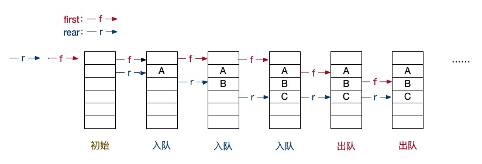
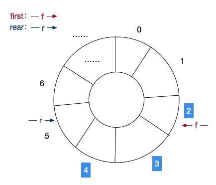
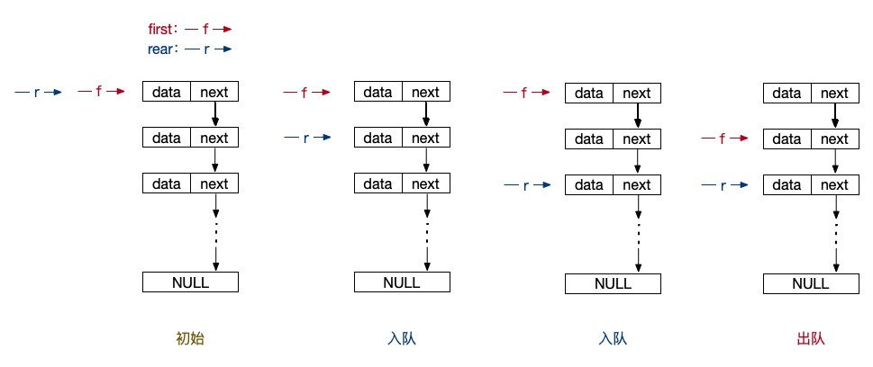

# 3.2 队列的相关逻辑操作

在逻辑结构中，我们已经学习了一个非常经典的结构类型：栈。今天，我们就来学习另外一个也是非常经典的逻辑结构类型：队列。相信不少同学已经使用过 redis 、 rabbitmq 之类的缓存队列工具。其实，数据库、程序代码，这些都可以实现队列的操作，就和栈一样，队列也是有其特定的规则，只要符合这个规则，它就叫做队列。

## 什么是队列？

相对于栈来说，队列是一种先进先出（FIFO）顺序逻辑结构。什么叫先进先出呢？就和我们的排队一样，当我们去银行或者医院的时候，总是要在门口取一个号，这个号是按顺序叫的。先来的人就可以先办业务或者看病，这就是一个典型的队列。同理，日常的排队就是一个标准的队列模式。如果有插队的，在有正当理由的情况下，我们可以认为它的优先级更高，这是队列中元素的一种特殊形式。就像我们会在等地铁或者公交的时候让孕妇优先，在排队买火车票的时候也有军人的优先窗口。不过，这个并不在我们这次的讨论范围之内。


在公交站排队时，排第一个的当然可以第一个上车，然后依次。这时，你来到了公交站，那么你只能排到最后一位。这个就是队列的具体表现形式。

同样，和栈一样，也有一些名词我们需要了解。当你来到公交站并排到最后一位时，这个操作叫作“入队”。当公交车进站后，第一位乘客上车，这个操作叫做“出队”。第一位乘客所处的位置叫做“队头”，你做为当前队列的最后一位乘客，你的位置就叫做“队尾”。回到代码逻辑上面来看，也就是说队列是从“队尾”“入队”，从“队头”“出队”。

## 顺序队列

OK，我们还是直接从来代码来看，首先看到的依然是顺序队的实现。

```php
class SqQueue{
    public $data;
    public $front;
    public $rear;
}
```

既然是顺序队，我们依然还是用一个数组 $data 来表示队内的元素。然后定义两个指针 $front 和 $rear 来表示队头和队尾。因为是顺序队，所以这里的指针其实也就是保存的是数组的下标。接下来的操作其实就非常的简单了，“入队”时 $rear++ ，“出队”时 $front++ 。

```php
function InitSqQueue(){
    $queue = new SqQueue();
    $queue->data = [];
    $queue->front = 0;
    $queue->rear = 0;
    return $queue;
}

function EnSqQueue(SqQueue &$queue, $e){
    $queue->data[$queue->rear] = $e;
    $queue->rear ++;
}

function DeSqQueue(SqQueue &$queue){
    // 队列为空
    if($queue->front == $queue->rear){
        return false;
    }
    $e = $queue->data[$queue->front];
    $queue->front++;
    return $e;
}

$q = InitSqQueue();
EnSqQueue($q, 'A');
EnSqQueue($q, 'B');
print_r($q);
// SqQueue Object
// (
//     [data] => Array
//         (
//             [0] => A
//             [1] => B
//         )

//     [front] => 0
//     [rear] => 2
// )
```

是不是感觉学过了栈之后，队列也很好理解了。初始化队列时，就是让队头和队尾指针都是 0 下标的记录就可以了。入队的时候让队尾增加，在这段代码中，我们入队了两个元素，打印出来的顺序队列内容就如注释所示。

```php
EnSqQueue($q, 'C');
EnSqQueue($q, 'D');
EnSqQueue($q, 'E');
print_r($q);
// SqQueue Object
// (
//     [data] => Array
//         (
//             [0] => A
//             [1] => B
//             [2] => C
//             [3] => D
//             [4] => E
//         )

//     [front] => 0
//     [rear] => 5
// )

echo DeSqQueue($q), PHP_EOL; // A
echo DeSqQueue($q), PHP_EOL; // B
echo DeSqQueue($q), PHP_EOL; // C
echo DeSqQueue($q), PHP_EOL; // D
echo DeSqQueue($q), PHP_EOL; // E

echo DeSqQueue($q), PHP_EOL; // 

print_r($q);
// SqQueue Object
// (
//     [data] => Array
//         (
//             [0] => A
//             [1] => B
//             [2] => C
//             [3] => D
//             [4] => E 
//         )

//     [front] => 5
//     [rear] => 5
// )
```

出队的时候，就让 $front 进行加 1 操作。不过，在出队的时候还需要判断数组中的元素是否全部出队了，在这里，我们只用了一个非常简单的判断条件，那就是 $front 和 $rear 是否相等来判断队列是否空了。大家可以通过一个图示来辅助对代码的理解。



### 循环队列

相信已经有不少同学看出来了。队列操作只是修改队头和队尾的指针记录，但是数组会一直增加，这样如果一直增加的话，就会导致这一个数组占满内存，这肯定不是一个好的队列实现。其实，在 C 语言中，数组就是要给一个固定的长度的。而 PHP 中的数组更像是一个 Hash 结构，所以它是可以无限增长的，并不需要我们在一开始定义一个具体的数组长度。这也是 PHP 的方便之处，不过如果我们不想浪费内存空间的话，应该怎么办呢？就像在 C 语言中一样，我们在 PHP 中也为数组指定一个长度，并且使用非常经典的“循环队列”来解决队列数组的存储问题。就像下图所示：



其实意思就是，在有限的数组空间范围内，当我们达到数组的最大值时，将新的数据保存回之前的下标位置。比如图中我们有 6 个元素，当前队头在 2 下标，队尾在 5 下标。如果我们入队一个元素，队尾移动到 6 下标。再添加一个元素的话，队尾移动回 0 下标，如果继续添加的话，当队尾下标等于队头下标减 1 的时候，我们就认为这个队列已经满了，不能再增加元素了。

同理，出队操作的时候我们也是循环地操作队头元素，当队头元素到 6 的下标后，继续出队的话，也会回到 0 下标的位置继续出队。当队头和队尾相等时，当前的队列也可以判定为空队列了。

由此，我们可以看出，循环队列相比普通的线性队列来说，多了一个队满的状态。我们还是直接从代码中来看看这个队满的条件是如何判断的。

```php
define('MAX_QUEUE_LENGTH', 6);

function EnSqQueueLoop(SqQueue &$queue, $e){
    // 判断队列是否满了
    if(($queue->rear + 1) % MAX_QUEUE_LENGTH == $queue->front){
        return false;
    }
    $queue->data[$queue->rear] = $e;
    $queue->rear = ($queue->rear + 1) % MAX_QUEUE_LENGTH; // 改成循环下标
}

function DeSqQueueLoop(SqQueue &$queue){
    // 队列为空
    if($queue->front == $queue->rear){
        return false;
    }
    $e = $queue->data[$queue->front];
    $queue->front = ($queue->front + 1) % MAX_QUEUE_LENGTH; // 改成循环下标
    return $e;
}

$q = InitSqQueue();
EnSqQueueLoop($q, 'A');
EnSqQueueLoop($q, 'B');
EnSqQueueLoop($q, 'C');
EnSqQueueLoop($q, 'D');
EnSqQueueLoop($q, 'E');

EnSqQueueLoop($q, 'F');

print_r($q);
// SqQueue Object
// (
//     [data] => Array
//         (
//             [0] => A
//             [1] => B
//             [2] => C
//             [3] => D
//             [4] => E
//             [5] =>   // 尾
//         )

//     [front] => 0
//     [rear] => 5
// )

echo DeSqQueueLoop($q), PHP_EOL;
echo DeSqQueueLoop($q), PHP_EOL;
print_r($q);
// SqQueue Object
// (
//     [data] => Array
//         (
//             [0] => A
//             [1] => B
//             [2] => C // 头
//             [3] => D
//             [4] => E
//             [5] =>   // 尾
//         )

//     [front] => 2
//     [rear] => 5
// )

EnSqQueueLoop($q, 'F');
EnSqQueueLoop($q, 'G');

EnSqQueueLoop($q, 'H');
print_r($q);
// SqQueue Object
// (
//     [data] => Array
//         (
//             [0] => G
//             [1] => B // 尾
//             [2] => C // 头
//             [3] => D
//             [4] => E
//             [5] => F
//         )

//     [front] => 2
//     [rear] => 1
// )

```

出、入队的下标移动以及队满的判断，都是以 ($queue->rear + 1) % MAX_QUEUE_LENGTH 这个形式进行的。根据队列长度的取模来获取当前的循环下标，是不是非常地巧妙。不得不感慨先人的智慧呀！当然，这也是基本的数据原理哦，所以，学习数据结构还是要复习一下数学相关的知识哦！

## 链式队列

顺序队列有没有看懵？没关系，队列的链式结构其实相比顺序结构还要简单一些，因为它真的只需要操作队头和队尾的指针而已，别的真的就不太需要考虑了。而且这个指针就是真的指向具体对象的指针了。

```php
class LinkQueueNode{
    public $data;
    public $next;
}

class LinkQueue{
    public $first; // 队头指针
    public $rear; // 队尾指针
}
```

这里我们需要两个基本的物理结构。一个是节点 Node ，一个是队列对象，节点对象就是一个正常的链表结构，没啥特别的。而队列对象里面就更简单了，一个属性是队头指针，一个属性是队尾指针。

```php
function InitLinkQueue(){
    $node = new LinkQueueNode();
    $node->next = NULL;
    $queue = new LinkQueue();
    $queue->first = $node;
    $queue->rear = $node;
    return $queue;
}

function EnLinkQueue(LinkQueue &$queue, $e){
    $node = new LinkQueueNode();
    $node->data = $e;
    $node->next = NULL;

    $queue->rear->next = $node;
    $queue->rear = $node;
}

function DeLinkQueue(LinkQueue &$queue){
    if($queue->front == $queue->rear){
        return false;
    }

    $node = $queue->first->next;
    $v = $node->data;

    $queue->first->next = $node->next;
    if($queue->rear == $node){
        $queue->rear = $queue->first;
    }

    return $v;
}

$q = InitLinkQueue();
EnLinkQueue($q, 'A');
EnLinkQueue($q, 'B');
EnLinkQueue($q, 'C');
EnLinkQueue($q, 'D');
EnLinkQueue($q, 'E');

print_r($q);
// LinkQueue Object
// (
//     [first] => LinkQueueNode Object
//         (
//             [data] => 
//             [next] => LinkQueueNode Object
//                 (
//                     [data] => A
//                     [next] => LinkQueueNode Object
//                         (
//                             [data] => B
//                             [next] => LinkQueueNode Object
//                                 (
//                                     [data] => C
//                                     [next] => LinkQueueNode Object
//                                         (
//                                             [data] => D
//                                             [next] => LinkQueueNode Object
//                                                 (
//                                                     [data] => E
//                                                     [next] => 
//                                                 )

//                                         )

//                                 )

//                         )

//                 )

//         )

//     [rear] => LinkQueueNode Object
//         (
//             [data] => E
//             [next] => 
//         )

// )

echo DeLinkQueue($q), PHP_EOL; // A
echo DeLinkQueue($q), PHP_EOL; // B

EnLinkQueue($q, 'F');
print_r($q);
// LinkQueue Object
// (
//     [first] => LinkQueueNode Object
//         (
//             [data] => 
//             [next] => LinkQueueNode Object
//                 (
//                     [data] => C
//                     [next] => LinkQueueNode Object
//                         (
//                             [data] => D
//                             [next] => LinkQueueNode Object
//                                 (
//                                     [data] => E
//                                     [next] => LinkQueueNode Object
//                                         (
//                                             [data] => F
//                                             [next] => 
//                                         )

//                                 )

//                         )

//                 )

//         )

//     [rear] => LinkQueueNode Object
//         (
//             [data] => F
//             [next] => 
//         )

// )
```

出、入队的代码函数和测试代码就一并给出了，是不是非常的简单。初始的队头元素依然是一个空节点做为起始节点。然后入队的时候，让 $rear 等于新创建的这个节点，并在链表中建立链式关系。出队的时候也是同样的让 $first 变成当前这个 $first 的下一跳节点，也就是 $first->next 就可以了。判断队空的条件也是简单的变成了队头和队尾指针是否相等就可以了。链队相比顺序队其实是简单了一些，不过同样的，$next 这个东西容易让人头晕，硬记下来就可以了。大家还是可以结合图示来学习：



## PHP 为我们提供的数组队列操作

最后，就和栈一样，PHP 代码中也为我们提供了一个可以用于队列操作的函数。

```php
$sqQueueList = [];

array_push($sqQueueList, 'a');
array_push($sqQueueList, 'b');
array_push($sqQueueList, 'c');

print_r($sqQueueList);
// Array
// (
//     [0] => a
//     [1] => b
//     [2] => c
// )

array_shift($sqQueueList);
print_r($sqQueueList);
// Array
// (
//     [0] => b
//     [1] => c
// )
```

array_shift() 函数就是弹出数组中最前面的那个元素。请注意，这里元素的下标也跟着变动了，如果我们是 unset() 掉数组的 0 下标元素的话，b 和 c 的下标依然还会是 1 和 2 。而 array_shift() 则会重新整理数组，让其下标依然有序。

```php
unset($sqQueueList[0]);
print_r($sqQueueList);
// Array
// (
//     [1] => c
// )
```

## 总结

关于栈的队列的内容我们就通过两篇文章介绍完了。不过光说不练假把式，接下来，我们来一点真实的干货，使用栈和队列来做做题呗，学算法就得刷题，一日不刷如隔三秋呀！！！

测试代码：


参考资料：

《数据结构》第二版，严蔚敏

《数据结构》第二版，陈越

《数据结构高分笔记》2020版，天勤考研