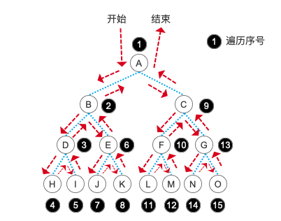
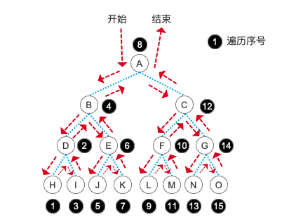
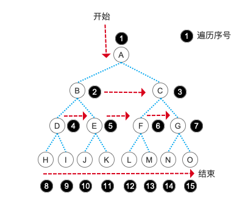

# 二叉树的遍历及逻辑操作

上篇文章我们讲了许多理论方面的知识，虽说很枯燥，但那些都是我们今天学习的前提，一会看代码的时候你就会发现这些理论知识是多么地重要了。首先，我们还是要说明一下，我们学习的主要内容是二叉树，因为二叉树是最典型的一种树的应用，不管是考试还是面试，它都是必知必学的内容。而一般的树和森林更为复杂一些，我们会在树系统相关的文章最后部分进行简单的介绍。

首先，在学习树的操作之前，我们先要明白在树的操作中，最核心的就是“遍历”。为什么这么说呢？不同于栈和队列，树结构其实已经不是一维的了，它有分支，有不同的角度，更重要的是它有了层级的概念。一维空间的东西就是我们常见的“线”，它只有长度，没有高度，而这个长度就是它唯一的维度，栈和队列很明显都是一维的。而树就不同了，因为层级的概念，所以它有了“高度”，也就是说，它升级到了二维的概念。就像上一篇文章中介绍的那一堆名词中，就有“树的高度（深度）”的概念。

能够遍历一颗树之后，我们就可以在遍历的基础上对这颗树的结点进行增、删、改等操作，这些基本的逻辑操作全都是建立在遍历的基础之上的，仔细回想一下栈和队列，其实它们的这些逻辑操作不也是从遍历入手吗？不管是出栈入栈还是出队入队，我们都是建立在一种固定的遍历规则之下的（FILO、FIFO）。

对于二维的事物，如何遍历它就是一个重点的内容。一维的数据结构我们只要顺序地去遍历就可以了，而二维的数据结果则不能简单的按顺序一个一个地去遍历了，因为结点之间有层次关系的存在，所以我们要考虑当前的结点如果没有子结点了，我们的遍历操作应该怎么办呢？


幸好，我们是站在巨人的肩膀上来学习这些知识。许多的前辈已经为我们总结出来了一些非常简单的对于树的遍历方法，有多简单呢？先卖个关子，我们先来看看如何建立一颗树，也就是我们在上篇文章中展示过的那颗二叉树。


## 二叉树的链式存储结构

使用链式存储二叉树非常简单，而且也很形象，小伙伴们先收起对顺序存储二叉树的疑问，因为在下一篇文章中我们就会讲解在什么情况下使用顺序存储。

```php
class BiTree
{
    public $data;
    public $lChild;
    public $rChild;
}
```

其实，在链式存储中，我们就是使用的一个个地结点来保存这颗树。每个二叉树结点都有一个数据域，也就是 $data 属性。另外两个属性就可以看做是两个分叉的指针，分别是这个结点的左孩子结点 $lChild 和右孩子结点 $rChild 。对比栈和队列来说，我们只是将 $next 结点换成了左、右两个孩子结点而已，本质上其实与栈和队列并没有太大的差别。说白了，从数据结构上来看，我们还是用一维的存储来表示二维的概念，而这个概念的转变则是我们需要从理解的角度出发的。

## 二叉树建树

```php
// 建立二叉树
function CreateBiTree($arr, $i)
{
    if (!isset($arr[$i])) {
        return null;
    }
    $t = new BiTree();
    $t->data = $arr[$i];
    $t->lChild = CreateBiTree($arr, $i * 2);
    $t->rChild = CreateBiTree($arr, $i * 2 + 1);
    return $t;
}
```

就这么一个简单的方法，我们就可以完成一个链式二叉树的建立。小伙伴们请仔细看好了，这一个简单的建树操作其实内含不少玄机：

- 我们使用一个数组来依次表示树的各个结点，比如依次输入 A 、 B 、 C 、 D 、 E …… （树的顺序存储中我们会再次看到它们的身影）

- 赋值的内容是当前 $i 下标的数据，注意我们在给左、右孩子赋值时进行了递归操作

- 在学习栈的时候，我们学习过“递归”就是一种栈式的操作，所以，在这段代码中，我们是以栈的形式来建树的

- 注意到每次的 $i * 2 和 $i * 2 + 1 了吧？请复习二叉树的 *性质5*

最后我们测试一下这个方法是否能够成功的建立一颗链式树结构。

```php
$treeList = ['', 'A', 'B', 'C', 'D', 'E', 'F', 'G', 'H', 'I', 'J', 'K', 'L', 'M', 'N', 'O'];

$tree = CreateBiTree($treeList, 1);
print_r($tree);

// BiTree Object
// (
//     [data] => A
//     [lChild] => BiTree Object
//         (
//             [data] => B
//             [lChild] => BiTree Object
//                 (
//                     [data] => D
//                     [lChild] => BiTree Object
//                         (
//                             [data] => H
//                             [lChild] =>
//                             [rChild] =>
//                         )

//                     [rChild] => BiTree Object
//                         (
//                             [data] => I
//                             [lChild] =>
//                             [rChild] =>
//                         )

//                 )

//             [rChild] => BiTree Object
//                 (
//                     [data] => E
//                     [lChild] => BiTree Object
//                         (
//                             [data] => J
//                             [lChild] =>
//                             [rChild] =>
//                         )

//                     [rChild] => BiTree Object
//                         (
//                             [data] => K
//                             [lChild] =>
//                             [rChild] =>
//                         )

//                 )

//         )

//     [rChild] => BiTree Object
//         (
//             [data] => C
//             [lChild] => BiTree Object
//                 (
//                     [data] => F
//                     [lChild] => BiTree Object
//                         (
//                             [data] => L
//                             [lChild] =>
//                             [rChild] =>
//                         )

//                     [rChild] => BiTree Object
//                         (
//                             [data] => M
//                             [lChild] =>
//                             [rChild] =>
//                         )

//                 )

//             [rChild] => BiTree Object
//                 (
//                     [data] => G
//                     [lChild] => BiTree Object
//                         (
//                             [data] => N
//                             [lChild] =>
//                             [rChild] =>
//                         )

//                     [rChild] => BiTree Object
//                         (
//                             [data] => O
//                             [lChild] =>
//                             [rChild] =>
//                         )

//                 )

//         )

// )
```

打印出来的内容应该非常清晰了吧？A 结点有左右两个孩子结点分别是 B 和 C ，B 结点有左右两个孩子分别是 D 和 E ，依次类推。最终的结构和我们上面那个二叉树图的结构完全一致。在这里，我们还需要注意的一点是，对于传递进来的数组，我们给第一个元素，也就是 0 下标的数据为空，并且是从第二个元素也就是 1 下标的元素开始建树的。这样也是为了能够直观方便的利用二叉树的 *性质5* 来快速地建立这颗树。

## 二叉树的遍历

说完二叉树的建树了，其实我们就已经接触到了一种二叉树的遍历形式。注意看我们建树方法中的代码，我们是先给结点的 $data 赋值，然后建立这个结点的左、右孩子结点，并为它们赋值后再继续使用同样的操作一路建立完成所有的结点。现在，我们将这个操作反过来，不是建立结点，而是读取这些结点的内容，先读取结点的内容，然后再读取这个结点左右孩子结点的内容，这就是“先序遍历”。

### 先序遍历

```php
/**
 * 前序遍历
 */
function PreOrderTraverse(?BiTree $t)
{
    if ($t) {
        echo $t->data, ',';
        PreOrderTraverse($t->lChild);
        PreOrderTraverse($t->rChild);
    }
}

PreOrderTraverse($tree);

// A,B,D,H,I,E,J,K,C,F,L,M,G,N,O,

```

是不是很神奇？就连建树我们竟然也使用的是一种遍历的方法，可以看出对于二叉树这种复杂的数据结构来说，遍历的重要作用了吧。

大家可以看一个遍历读取出来的结点顺序，貌似和我们输入的顺序不一样呀！没错，先序遍历是通过递归，先按一个方向走到底，当这个结点没有子结点之后，通过递归栈的特性再向上弹出。*并且在遍历孩子结点之前先输出当前这个结点的内容*。注意，这一句话很重要！所以我们的顺序就是 A,B,D,H ，当 H 没有子结点之后，我们就回到父结点 D 再进入它的右子结点 I ，具体顺序可以参考下图：



我们代码中的先序遍历和先序建树的结点顺序是完全不一样的，这一点也是要搞清楚的。建树的过程我们根据二叉树的 *性质5* 直接为它指定了数据下标。而在遍历过程中则是一个结点一个结点的去扫描遍历整颗树的。

### 中序遍历

顾名思义，中序遍历其实就是在遍历完左孩子结点之后再输出当前这个结点的内容，所以我们只需要微调先序遍历的代码即可。

```php
/**
 * 中序遍历
 */
function InOrderTraverse(?BiTree $t)
{
    if ($t) {
        InOrderTraverse($t->lChild);
        echo $t->data, ',';
        InOrderTraverse($t->rChild);
    }
}

InOrderTraverse($tree);

// H,D,I,B,J,E,K,A,L,F,M,C,N,G,O,
```

中序遍历的步骤就是我们会直接先走到最左边的子结点，当遇到最后一个结点时，输出内容，也就是图中的 H 结点，接着回到它的父结点 D 结点，这时根据中序的原理输入 D ，再进入它的右孩子结点并输出 I 。D 结点的子树及它本身遍历完成后，返回 D 结点的上级结点 B 结点，输出 B ，然后进入 B 结点的右孩子结点 E 。再次进入到 E 的最左孩子结点 J ，然后参考 D 结点的遍历形式完成整颗树的遍历。具体顺序参考下图：



### 后序遍历

在学习了先序和中序之后，从名字就可以看出来后序就是在遍历完一个结点的左右孩子之后最后输出这个结点的内容，代码当然也是简单地微调一下。

```php
/**
 * 后序遍历
 */
function PostOrderTraverse(?BiTree $t)
{
    if ($t) {
        PostOrderTraverse($t->lChild);
        PostOrderTraverse($t->rChild);
        echo $t->data, ',';
    }
}

PostOrderTraverse($tree);

// H,I,D,J,K,E,B,L,M,F,N,O,G,C,A,
```

具体原理就不详细说明了，相信在学习了先序和中序之后，你一定能马上想明白后序遍历到底是什么意思了。直接上图：


### 层序遍历

最后，我们要讲的就是层序遍历。既然就“层”这个关键字了，相信大家马上就能联想到，是不是一层一层地去遍历啊！没错，层序遍历就是这个意思，我们按照树的层次，一层一层地输出相应的结点信息。需要注意的，在这里我们会用到队列，而不是栈了。

```php
/**
 * 层序遍历
 */
$q = InitLinkQueue();
function LevelOrderTraverse(?BiTree $t)
{
    global $q;
    if (!$t) {
        return;
    }

    EnLinkQueue($q, $t);
    $node = $q;
    while ($node) {
        $node = DeLinkQueue($q);
        if ($node->lChild) {
            EnLinkQueue($q, $node->lChild);
        }
        if ($node->rChild) {
            EnLinkQueue($q, $node->rChild);
        }
        echo $node->data, ',';
    }
}

LevelOrderTraverse($tree);

// A,B,C,D,E,F,G,H,I,J,K,L,M,N,O,
```

InitLinkQueue() EnLinkQueue() 、 EnLinkQueue() 这些都是我们之前学习队列的时候所写的对于队列的逻辑操作方法。是不是很开心呀，之前的知识又用上了。层序遍历的核心思想就是运用队列的概念，遇到一个结点，就把这个结点入队，然后判断它是否有子结点，然后相继把子结点入队。每遍历一个结点，就把队首的结点出队，这样就完成了按树的层次遍历的能力。文字说明还是太抽象，我们还是通过图片来展示这一过程：



大家有没有发现，层序遍历的输出结果就和我们建树时的数组顺序完全相同了。很好玩吧，所以说代码的世界总是有无穷的乐趣等着我们去发现哦！

## 总结

今天的内容有没有懵圈？如果懵圈了就多找资料好好研究一下，先序、中序、后序都是利用栈来进行树的结点遍历的，而层序遍历则是利用了队列。一环套一环呀，前面学习的内容都派上用场了吧！不过这只是个开始，在学习图的时候，我们会在深度遍历和广度遍历中再次看到栈和队列的身影，它们可都是亲戚哦。

这四种遍历方式在考试和面试中也是经常出现的，不管是它们的原理还是画图或者是根据图形来写出各种遍历的顺序，都是非常常见的考核内容，所以大家在这篇文章入门的基础上还是要更加深入的去根据一些教材来深入的理解这几种遍历，熟练的掌握它们。

测试代码：


参考资料：

《数据结构》第二版，严蔚敏

《数据结构》第二版，陈越

《数据结构高分笔记》2020版，天勤考研