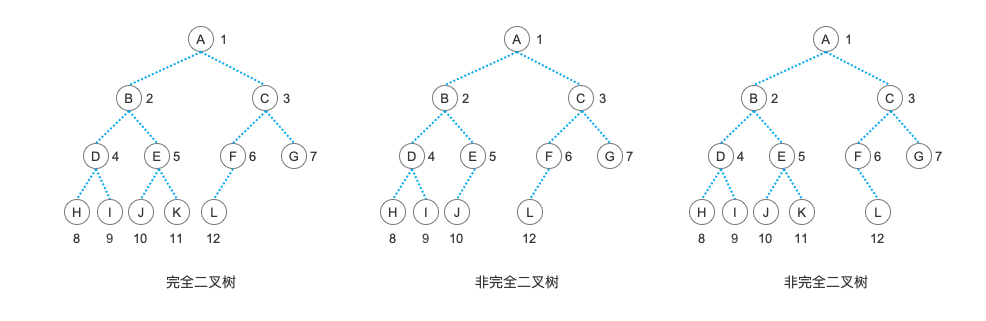
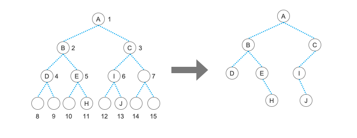
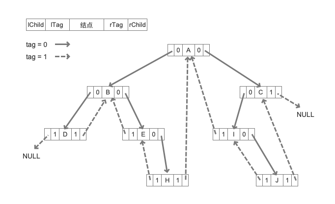

# 完全二叉树、线索二叉树及树的顺序存储结构

在上篇文章中，我们学习了二叉树的基本链式结构以及建树和遍历相关的操作。今天我们学习的则是一些二叉树相关的概念以及二叉树的一种变形形式。

## 完全二叉树

什么叫完全二叉树呢？在说到完全二叉树之前，我们先说另外一个名词：“满二叉树”。像我们之前文章中演示过的那个二叉树，就是一颗“满二叉树”。在这颗树中，所有的结点都有两个孩子结点，没有哪个结点是只有一个孩子结点的，并且所有最底层的叶子结点都在同一层，这种树就称为“满二叉树”，也称为“完美二叉树”。


是不是非常漂亮的一颗树？没错，这种二叉树非常地完美，它没有多余的结点，也没有缺少的结点，非常的漂亮。但是，在现实中，完美的东西是很稀少的，人生总会有一点缺憾嘛。我们尽量不要让自己有太多的缺憾，但也总不能过上没有一丝缺憾的人生。所以，我们允许叶结点出现在最下层和次下层，而且最下层的叶结点集中在树的左部，也就是叶结点只能有左子树，那么，这样的一颗略带缺憾的树就叫做“完全二叉树”。不要担心它不完美，因为这样略带缺憾的人生才是完整的嘛，所以“完全二叉树”是一种理想的树结构。



从定义中，我们可以看出，一颗“满二叉树”，必定是一颗“完全二叉树”，而一颗叶子结点都在一层的并且所有结点都有左右孩子结点的“完全二叉树”也就是一颗”满二叉树“。

为什么要讲”满二叉树“和”完全二叉树“呢？当然是为了我们接下来的内容做铺垫。因为”满二叉树“是最符合二叉树性质的一颗树。还记得树系列的第一篇文章中介绍过的二叉树的那五个性质吗？当时我们就是以那颗”满二叉树“为例进行讲解的。而其中的 性质5 ，就是我们学习使用顺序结构存储二叉树的基础。

## 二叉树的顺序存储

通过”满二叉树“的概念，以及二叉树的 性质5 我们就可以实现使用一个数组来存储顺序结构的实现。

```php
$treeList = ['', 'A', 'B', 'C', 'D', 'E', 'F', 'G', 'H', 'I', 'J', 'K', 'L', 'M', 'N', 'O'];
```

相信大家不陌生吧，在上篇文章中，我们就是通过这个数组来建立链树的，而这个数组其实就是一个线性存储的二叉树。我们通过对比二叉树的 性质5 来看一下。

- A 结点的下标是 1 ，它是我们的树根。它的子结点是 B 和 C ，对应的下标分别是 2 和 3 ，也就是 1 * 2 和 1 * 2 + 1 。

- 同理，我们再选取一个结点 F 。它的下标是 6 ，所以它的左孩子结点的下标是 6 * 2 = 12 ，对应的是 L ；它的右孩子结点是 6 * 2 + 1 = 13 ，对应的是 M 。

- 反过来看，一个结点的父结点就是 i / 2 。我们看下 K 结点的下标是 11 ，它的父结点就是 11 / 2 ，舍去小数点是下标 5 的位置，也就是结点 E ；结点 J 的下标是 10 ，它的父结点是 10 / 2 ，也是下标为 5 的 E 结点。

这下想以大家就明白了用数组是如何表示一颗二叉树结构了吧。而且数组这种结构更加的一维，更能体现出对于树的操作就是二维化一维的一种表示，也就是非线性转线性，这样才能让我们方便地操作这些数据。

针对顺序存储结构，也就是数组元素的遍历，也是可以使用先序、中序、后序以及层序的形式。不过这些遍历方法都需要根据二叉树的 性质5 来进行遍历。但更重要的是，只要给我一个下标，我们通过二叉树的性质，就可能很容易地知道它的下级结点和上级结点的位置，能够快速地获得这些结点的信息。这一大特点是链式结构的二叉树所没有的。

如果我们要存储的不是一颗”满二叉树“呢？甚至它都不是一颗完全二叉树的情况下，只需要将对应的结点设置为空值就行了。比如：

```php
$treeList = ['', 'A', 'B', 'C', 'D', 'E', 'I', '', '', '', '', 'H', '', 'J', '', ''];
```

这颗树的结构所对应的二叉树图形就是这样的：



然后在建链树的方法中，我们只需要再增加一个判断就可以了。我们就可以通过这样一个顺序存储的二叉树快速地生成一颗链式存储的二叉树，方便我们之后的操作。

```php
// 建立二叉树
function CreateBiTree($arr, $i)
{
    if (!isset($arr[$i]) || !$arr[$i]) { // 这里增加了个判断，如果数组元素为空
        return null;
    }
    $t = new TBTNode();
    $t->data = $arr[$i];
    $t->lChild = CreateBiTree($arr, $i * 2);
    $t->rChild = CreateBiTree($arr, $i * 2 + 1);
    return $t;
}
```

## 线索二叉树

一环套一环，接下来我们再来讲讲”线索二叉树“。这又是个什么东西呢？

从上面的学习中，我们知道了”满二叉树“和”完全二叉树“。但是这种结构都是非常理想的树结构，不过真实的情况可能大部分都是”理想很丰满，现实很骨感“。很多树并不能形成那样的完全二叉树的形式，更别提”满二叉树“了。而树的遍历又经常会使用栈或者队列来实现，这两种遍历方式基本都是线性的，也就是最好情况下也是 O(n) 的时间复杂度。那么，有没有什么更快一点的方式来提高遍历的效率呢？

我们这样来尝试一下：

- 如果树的叶子结点的左孩子结点为空，就让它指向前驱（上级）结点

- 如果树的叶子结点的右孩子结点为空，就让它指向后继结点

这样有什么好处呢？我们可以避免掉大范围的递归操作，从而加快树的遍历速度。在整个算法中，它并没有什么优势，因为我们需要将一颗树进行线索化，也就是去改变它的叶子结点的左右孩子的指向，这也是一次遍历。但是，如果你的操作是经常需要遍历，而且是来回的多次遍历，那么它的整体性能是要强于普通二叉树的遍历的。因为在一次线索化之后，它的遍历就是在快速的查找叶子结点的基础上进行普通的线性遍历操作，而不是递归操作。

对于线索二叉树来说，我们需要改变树的结点存储数据结构。

```php
// 线索二叉树结点
class TBTNode
{
    public $data;
    public $lTag = 0;
    public $rTag = 0;
    public $lChild;
    public $rChild;
}
```

我们增加了两个标志位，当 $lTag 或 $rTag 为 1 时，$lChild 或 $rChild 分别指向前驱或后继结点。这样在最后的遍历时，我们就可以快速地通过这个 tag 标志位分辨出结点的指向状态。

然后我们先简单地建立一颗树。使用上一节中的那个示例。

```php
// 建立二叉树
function CreateBiTree($arr, $i)
{
    if (!isset($arr[$i]) || !$arr[$i]) { // 这里增加了个判断，如果数组元素为空
        return null;
    }
    $t = new TBTNode();
    $t->data = $arr[$i];
    $t->lChild = CreateBiTree($arr, $i * 2);
    $t->rChild = CreateBiTree($arr, $i * 2 + 1);
    return $t;
}

$treeList = ['', 'A', 'B', 'C', 'D', 'E', 'I', '', '', '', '', 'H', '', 'J', '', ''];

$tree = CreateBiTree($treeList, 1);
```

接下来就是最重要的线索化过程，我们可以建立前序、中序、后序的线索二叉树。对应的，在最后的线索二叉树遍历时获得的结果也将是这三种遍历方式所对应的结果。在这里，我们学习最普遍的也是最经典的”中序线索二叉树“。所以，我们以中序遍历的形式将这颗树线索化。

```php
// 线索化
function InThread(?TBTNode $p, ?TBTNode &$pre)
{
    if ($p) {
        // 递归，左子树线索化
        InThread($p->lChild, $pre);

        if (!$p->lChild) {
            // 建立当前结点的前驱线索
            $p->lChild = $pre;
            $p->lTag = 1;
        }
        if ($pre && !$pre->rChild) {
            // 建立当前结点的后继线索
            $pre->rChild = $p;
            $pre->rTag = 1;
        }
        $pre = $p; // $pre 指向当前的 $p ，作为 $p 将要指向的下一个结点的前驱结点指示指针
        $p = $p->rChild; // $p 指向一个新结点，此时 $pre 和 $p 分别指向的结点形成了一个前驱后继对，为下一次线索化做准备
        
        // 递归，右子树线索化
        InThread($p, $pre);
    }
}

// 创建线索二叉树
function createInThread(TBTNode $root)
{
    $pre = null; // 前驱结点指针
    if($root){
        InThread($root, $pre);
        $pre->rChild = null; // 非空二叉树，线索化
        $pre->rTag = 1; // 后处理中序最后一个结点
    }
}

createInThread($tree);

var_dump($tree);
// object(TBTNode)#1 (5) {
//     ["data"]=>
//     string(1) "A"
//     ["lTag"]=>
//     int(0)
//     ["rTag"]=>
//     int(0)
//     ["lChild"]=>
//     object(TBTNode)#2 (5) {
//       ["data"]=>
//       string(1) "B"
//       ["lTag"]=>
//       int(0)
//       ["rTag"]=>
//       int(0)
//       ["lChild"]=>
//       object(TBTNode)#3 (5) {
//         ["data"]=>
//         string(1) "D"
//         ["lTag"]=>
//         int(1)
//         ["rTag"]=>
//         int(1)
//         ["lChild"]=>
//         NULL
//         ["rChild"]=>
//         *RECURSION*
//       }
//       ……
```

关于算法的具体步骤在注释中已经写得很详细了。一句话总结就是在中序遍历的过程中，根据结点的信息来确定它的左右孩子的形式，如果有左右孩子就继续，如果没有任一一个孩子的话，就将左右结点指向前驱或者后继。建立之后的线索二叉树就如图所示：



最后就是遍历了。我们需要的是能够快速地获得最左叶子结点的信息，然后就是下一跳的信息，这时，线索的威力就发挥出来了。

```php
// 以 $p 为根的中序线索二叉树中，中序序列下的第一个结点，也就是最左边那个结点
function First(?TBTNode $p){
    while($p->lTag == 0){
        $p = $p->lChild; // 最左下结点（不一定是叶子结点）
    }
    return $p;
}

// 在中序二叉树中，结点 $p 在中序下的后继结点
function NextNode(?TBTNode $p){
    if($p->rTag == 0){
        return First($p->rChild);
    }else{
        return $p->rChild; // 如果 rTag == 1 ，直接返回后继线索
    }
}

// 在中序线索二叉树上进行中序遍历
function Inorder(TBTNode $root){
    //     第一个结点      结点不为空    下一个结点
    for($p = First($root);$p;$p=NextNode($p)){
        echo $p->data, ',';
    }
}

Inorder($tree); // D,B,E,H,A,I,J,C, 
```

当遇到 $lTag 不为 0 的结点时，这个结点就是最左的那个结点了，如果这个不为空的话，【输出】它。接着我们获得下一跳的结点，也就是判断这个结点的右孩子 $rTag 标志，如果是为 0 的，也就是它还有右孩子，【输出】后向下查找，直到找到一个 $rTag 也为 1 的结点，直接返回这个结点的后继，也就是中序遍历的中间那个结点，【输出】它。

最后输出的顺序是不是和我们中序遍历的结果一样呢？注意看代码，在遍历中序线索二叉树的时候，我们没有用一个递归吧，全部是使用的 while() 和 for() 就完成了对这个线索二叉树的遍历。

## 总结

坚持到现在不容易，不能再小看数据结构了吧？现在还只是树，我们的图都还没开始呢！当然，也不要害怕，一步一步的学，慢慢掌握，不要幻想一口气吃成个胖子。写完这篇文章我也不可能马上就手写出一个中序的线索二叉树来的。大家还是以理解原理为主，如果说真能手写的话，那也是为了面试而去背的或者是为了考研而准备的。这样的小同学在面试中我反而要更多问一些其它的问题，毕竟临时抱佛脚的准备远不如深入理解带来的感悟更能打动人！

测试代码：


参考资料：

《数据结构》第二版，严蔚敏

《数据结构》第二版，陈越

《数据结构高分笔记》2020版，天勤考研