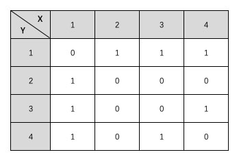
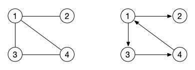
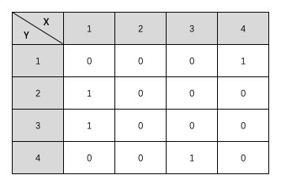
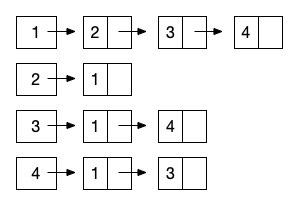
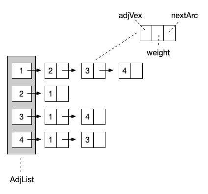

# 图的存储结构

图的概念介绍得差不多了，大家可以消化消化再继续学习后面的内容。如果没有什么问题的话，我们就继续学习接下来的内容。当然，这还不是最麻烦的地方，因为今天我们只是介绍图的存储结果而已。

## 图的顺序存储结构：邻接矩阵

### 什么是邻接矩阵

首先还是来看看如何用顺序结构来存储图。不管是栈、队列、树，我们都可以使用一个简单的数组就可以实现这些数据结构的顺序存储能力。但是图就不一样了，从上篇文章中，我们学到过，一个结点的表示是 <x, y> 这种形式。如果我们把这个结点相像是一个坐标轴上的点，那么我们是不是就可以用一个二维数组来表示它呢？没错，让二维数组的第一维表示为 x 轴，第二维表示为 y 轴，这样我们就可以构建出一张图来了。没错，二维数组这种形式还有一个边名就叫做：矩阵。

在图的术语中，使用二维数组来表示的图的顺序存储结构就叫做邻接矩阵。就像下面这个表格一样。



在这个表格中，我们有横竖两个坐标，X1-4 和 Y1-4 表示这个图中一共有 4 个结点，通过它们的对应关系就可以看做是一个结点与另一个结点之间是否有边。比如说 X1 和 Y2 这一对坐标 <X1, Y2> ，它们的值是 1 ，这就说明 结点1 到 结点2 之间有一条边。在这里，我们使用的是无权图，也就是用 0 表示没有边，用 1 表示两个结点之间有边。同时，它还是一张无向图，所以 <Y2, X1> 的值也是 1 ，它的意图是从 结点2 到 结点1 之间也有一条边。如果是有向图，那么就要根据有向箭头的指向来确定这条边是否设置为 1 。

上面的这个邻接矩阵对应的图是什么样子的呢？大家可以自己尝试手动画一画。画不出来也不要紧，因为我们才刚开始学嘛。其实它就是我们最开始展示的那张图的邻接矩阵。



左边的图就是对应的我们上面的那个表格中的邻接矩阵。那么右边那个有向图的邻接矩阵是什么样子的呢？我们也写写试试。



有意思吧？那么如果是有权图呢？其实很简单的我们将图中的 1 直接换成对应边的权值就可以了，不过有可能有的边的权值就是 0 ，所以在有权图中，我们可以定义一个非常大的数，或者定义一个非常小的负数当做 无限数 来表示这两个结点没有边。

### 构造邻接矩阵

接下来，我们就通过代码来构造这样一个邻接矩阵的存储结构。我们还是用无向图的例子来实现。因为无向图是需要反向的结点也赋值的，所以它比有向图多了一个步骤，其它的基本上都是相似的。

```php
// 邻接矩阵
$graphArr = [];
function CreateGraph($Nv, &$graphArr)
{
    $graphArr = [];
    for ($i = 1; $i <= $Nv; $i++) {
        for ($j = 1; $j <= $Nv; $j++) {
            $graphArr[$i][$j] = 0;
        }
    }
}

// 邻接矩阵
function BuildGraph(&$graphArr)
{
    echo '请输入结点数：';
    fscanf(STDIN, "%d", $Nv);
    CreateGraph($Nv, $graphArr);

    if ($graphArr) {
        echo '请输入边数：';
        fscanf(STDIN, "%d", $Ne);
        if ($Ne > 0) {
            for ($i = 1; $i <= $Ne; $i++) {
                echo '请输入边，格式为 出 入 权：';
                fscanf(STDIN, "%d %d %d", $v1, $v2, $weight);
                $graphArr[$v1][$v2] = $weight;
                // 如果是无向图，还需要插入逆向的边
                $graphArr[$v2][$v1] = $weight;
            }
        }
    }
}
```

在这段代码中，首先我们通过 CreateGraph() 方法来初始化一个二维矩阵。也就是根据我们输入的结点数量，实现一个 X * X 的二维数组结构，并且定义它的所有值都是 0 ，也就是说，这个图目前还没有边。

然后，在 BuildGraph() 方法调用完 CreateGraph() 之后，我们继续输入边的信息。先输入边的数量，我们有几条边，如果边小于等于 0 的话就不要继续创建了。其实还可以严谨一点根据 无向完全图和有向完全图 的定义来让边不能超过最大的限度。

接下来，我们就循环继续输入边的信息，这里我需要的输入格式是边的 出结点 、入结点 、权值。由于我们的示例是无向图，所以我们除了要为 <x, y> 创建边之外，也要为 <y, x> 创建边。代码的注释中已经说明了。

解释代码可能还是比较抽象。直接运行一下试试吧。

```php
BuildGraph($graphArr);
// 请输入结点数：4
// 请输入边数：4
// 请输入边，格式为 出 入 权：1 2 1
// 请输入边，格式为 出 入 权：1 3 1
// 请输入边，格式为 出 入 权：1 4 1
// 请输入边，格式为 出 入 权：3 4 1

print_r($graphArr);
// Array
// (
//     [1] => Array
//         (
//             [1] => 0
//             [2] => 1
//             [3] => 1
//             [4] => 1
//         )

//     [2] => Array
//         (
//             [1] => 1
//             [2] => 0
//             [3] => 0
//             [4] => 0
//         )

//     [3] => Array
//         (
//             [1] => 1
//             [2] => 0
//             [3] => 0
//             [4] => 1
//         )

//     [4] => Array
//         (
//             [1] => 1
//             [2] => 0
//             [3] => 1
//             [4] => 0
//         )

// )
//  x
//y 0 1 1 1
//  1 0 0 0
//  1 0 0 1
//  1 0 1 0
```

在命令行环境中调用我们的 PHP 文件，然后根据提示的内容依次输入相关的信息。最后打印出来的数组内容是不是就和我们上面的表格中一模一样了。简简单单的一段代码，我们就实现了图的顺序存储。

可能有的同学会一时懵圈。因为我第一眼看到的时候也是完全懵了，不过仔细的对比画出来的图和上面的表格其实马上就能想明白了。这次我们真的是进入二维的世界了。是不是感觉图瞬间就把树甩到十万八千里之外了。完全二叉树的时候，我们的思想是二维的，但结构还是一维的，而到邻接矩阵的时候，不管是思想还是代码结构，全部都进化到了二维空间，高大上真不是吹的。

## 图的链式存储结构：邻接表

说完顺序存储结构，自然不能忽视另一种形式的存储结构，那就是图的链式存储结构。其实对于图来说，链式结构非常简单和清晰，因为我们只需要知道一个结点和那些结点有边就行了。那么我们就让这个结点形成一个单链表，一路往后链接就好了，就像下图这样。（同样以上图无向图为例）



从 结点1 开始，它指向一个后继是 结点2 ，然后继续向后链接 结点3 和 结点4 。这样，与 结点1 相关的边就都描述完成了。由于我们展示的依然是无向图的邻接表表示，所以 结点2 的链表结点指向了 结点 1 。也就是完成了 <y, x> 的反向指向。

对象代码实现来说，我们可以将头结点，也就是正式的 1-4 结点保存在一个顺序表中。然后让每个数组元素的值为第一个结点的内容。这样，我们就可以让链表结点只保存结点名称、权重和下一个结点对象的指向信息就可以了。

```php
// 头结点
class AdjList
{
    public $adjList = []; // 顶点列表
    public $Nv = 0; // 结点数
    public $Ne = 0; // 边数
}
// 边结点
class ArcNode
{
    public $adjVex = 0; // 结点
    public $nextArc = null; // 链接指向
    public $weight = 0; // 权重
}
```



接下来，我们来看看如何使用邻接表这种结构来建立图。

```php
function BuildLinkGraph()
{
    fscanf(STDIN, "请输入 结点数 边数：%d %d", $Nv, $Ne);
    if ($Nv > 1) {
        // 初始化头结点
        $adj = new AdjList();
        $adj->Nv = $Nv; // 保存下来方便使用
        $adj->Ne = $Ne; // 保存下来方便使用
        // 头结点列表
        for ($i = 1; $i <= $Nv; $i++) {
            $adj->adjList[$i] = null; // 全部置为 NULL ，一个无边空图
        }
        
        if ($Ne > 0) {
//
            for ($i = 1; $i <= $Ne; $i++) {
                echo '请输入边，格式为 出 入 权：';
                fscanf(STDIN, "%d %d %d", $v1, $v2, $weight);
                // 建立一个结点
                $p1 = new ArcNode;
                $p1->adjVex = $v2; // 结点名称为 入结点
                $p1->nextArc = $adj->adjList[$v1]; // 下一跳指向 出结点 的头结点
                $p1->weight = $weight; // 设置权重
                $adj->adjList[$v1] = $p1; // 让头结点的值等于当前新创建的这个结点

                // 无向图需要下面的操作，也就是反向的链表也要建立
                $p2 = new ArcNode;

                // 注意下面两行与上面代码的区别
                $p2->adjVex = $v1; // 这里是入结点
                $p2->nextArc = $adj->adjList[$v2]; // 这里是出结点
                
                $p2->weight = $weight;
                $adj->adjList[$v2] = $p2;
            }

            return $adj;
        }

    }

    return null;
}
```

代码中的注释已经写得很清楚了。可以看出，在邻接表的操作中，无向图也是一样的比有向图多一步操作的，如果只是建立有向图的话，可以不需要 $p2 结点的操作。特别需要注意的就是，在这段代码中，我们使用的是链表操作中的 头插法 。也就是最后一条数据会插入到 头结点 上，而最早的那个边会在链表的最后。大家看一下最后建立完成的数据结构的输出就明白了。

```php
print_r(BuildLinkGraph());
// AdjList Object
// (
//     [adjList] => Array
//         (
//             [1] => ArcNode Object
//                 (
//                     [adjVex] => 4
//                     [nextArc] => ArcNode Object
//                         (
//                             [adjVex] => 3
//                             [nextArc] => ArcNode Object
//                                 (
//                                     [adjVex] => 2
//                                     [nextArc] => 
//                                     [weight] => 1
//                                 )

//                             [weight] => 1
//                         )

//                     [weight] => 1
//                 )

//             [2] => ArcNode Object
//                 (
//                     [adjVex] => 1
//                     [nextArc] => 
//                     [weight] => 1
//                 )

//             [3] => ArcNode Object
//                 (
//                     [adjVex] => 4
//                     [nextArc] => ArcNode Object
//                         (
//                             [adjVex] => 1
//                             [nextArc] => 
//                             [weight] => 1
//                         )

//                     [weight] => 1
//                 )

//             [4] => ArcNode Object
//                 (
//                     [adjVex] => 3
//                     [nextArc] => ArcNode Object
//                         (
//                             [adjVex] => 1
//                             [nextArc] => 
//                             [weight] => 1
//                         )

//                     [weight] => 1
//                 )

//         )

//     [Nv] => 4
//     [Ne] => 4
// )
```

使用邻接表来建立的图的链式存储结构是不是反而比邻接矩阵更加的清晰明了一些。就像树的链式和顺序结构一样，在图中它们的优缺点也是类似的。邻接矩阵占用的物理空间更多，因为它需要两层一样多元素的数组，就像上面的表格一样，需要占据 4 * 4 的物理的格子。而邻接表我们可以直接数它的结点数，只需要 12 个格子就完成了。而且，更主要的是，链式的邻接表可以随时扩展边结点和边数，不需要重新地初始化，我们只需要简单地修改上面的测试代码就能够实现，而邻接矩阵如果要修改结点数的话，就得要重新初始化整个二维数组了。

## 总结

对于图来说，除了邻接矩阵和邻接表之外，还有其它的一些存储形式，不过都是链式的邻接表的一些优化和变形而已。大家有兴趣的可以自己去了解一下 十字链表 、邻接多重表 这两种存储结构。

好了，基础的存储结构已经铺垫完了，关于图的概念也都熟悉掌握了，接下来，我们就要准备去做最重要的操作了，那就是如何来对图进行遍历。


测试代码：


参考资料：

《数据结构》第二版，严蔚敏

《数据结构》第二版，陈越

《数据结构高分笔记》2020版，天勤考研