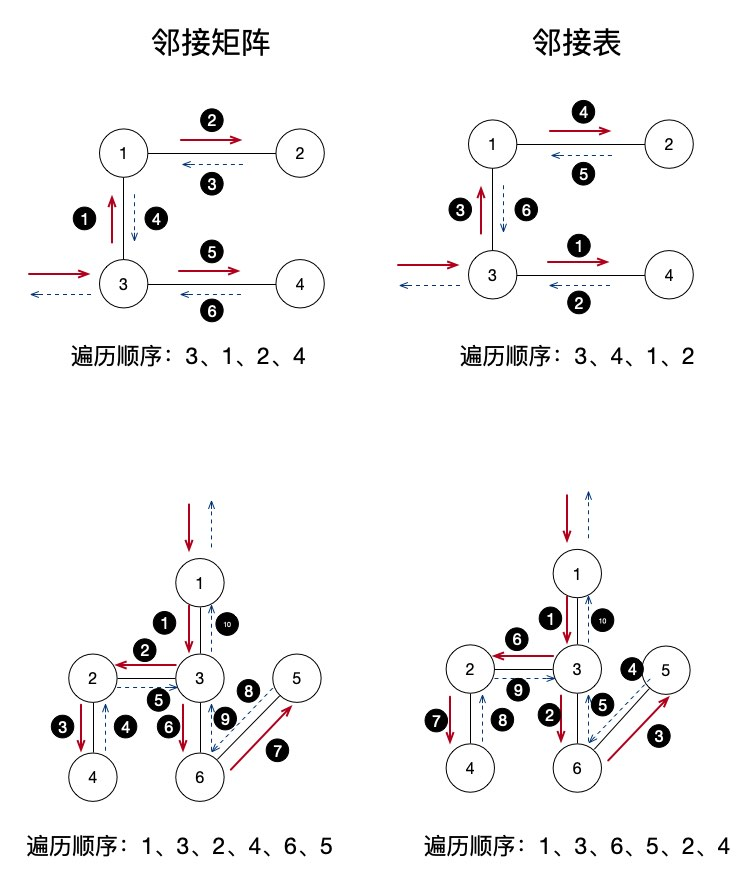
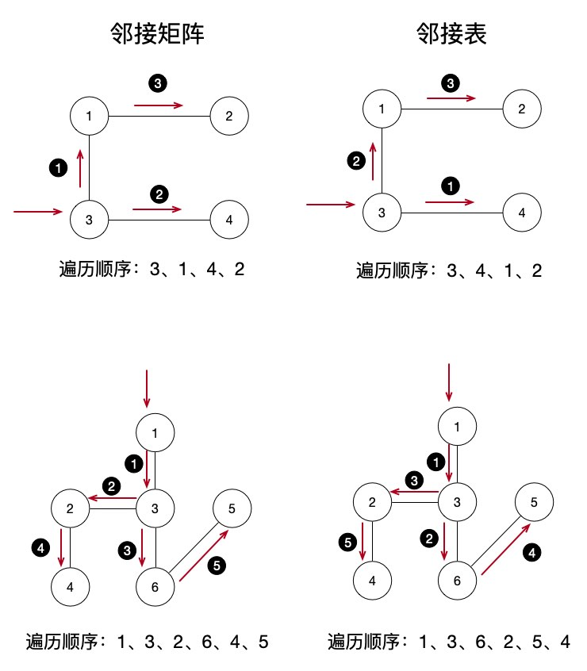

# 图的遍历：深度优先与广度优先

在上一篇文章中，我们学习完了图的相关的存储结构，也就是 邻接矩阵 和 邻接表 。它们分别就代表了最典型的 顺序存储 和 链式存储 两种类型。既然数据结构有了，那么我们接下来当然就是学习对这些数据结构的操作啦，也就是算法的部分。不管是图还是树，遍历都是很重要的部分，今天我们就先来学习最基础的两种图的遍历方式。

## 树的遍历演化到图的遍历

还记得在树的学习中，我们讲到过先序、中序、后序以及层序遍历这几种遍历形式吗？其实先序、中序和后序可以看作是一种遍历方式，它们都是使用栈结构来进行遍历，特点就是先一条路走到黑，然后再返回来走没有过的路。而层序遍历则是使用队列一层一层地进行遍历，特点就是先遍历完子结点，然后再挨个遍历每个子结点的下一层结点。

复习完了树的遍历方式再学习图的遍历方式就会非常简单了，因为在图的遍历中，最基础的也是基于栈和队列的两种遍历形式。只不过它们的名字略有不同，基于栈的遍历方式叫作 *深度优先遍历* ，而基于队列的遍历方式叫作 *广度优先遍历* 。其实也就是对应着树中的先、中、后序遍历和层序遍历，本质上没有什么太大的区别。

## 深度优先遍历

我们依然还是从栈的遍历方式入手，也就是图中的 *深度优先遍历* 这种形式。对于栈来说，不断地将新的结点压栈，直到发现它没有其它的子结点后再原路返回，当发现某个结点有其它的结点时再进入子结点压栈，这就是深度遍历的思想。

在这里，需要注意的是我们要记录一下已经访问过的结点，当出现多个结点都有连接到某一个结点的路径时，保证这个结点只访问过一次。这是和树结构的最大不同，因为树是一路向下的，平级结点之间没有联系，一个结点只有一个上级结点。而图则是任意一个结点都可以和其它任意的结点有关系。

### 邻接矩阵

首先，我们看一下邻接矩阵的深度优先遍历算法的实现。现在看不懂没关系，往下拉去看下图解，然后结合着一起看。当然，更好的方案是自己运行起来。

```php
$visited = []; // 已访问结点

function DFS_AM($graphArr, $x)
{
    global $visited;
    echo "节点：{$x}", PHP_EOL;
    $visited[$x] = true; // 当前结点标记为已访问
     
    // y 就是邻接矩阵中的横行
    for ($y = 1; $y <= count($graphArr); $y++) {
        // 循环判断第 [x][y] 个数据是否为 1，也就是是否有边
        // 并且这个结点没有被访问过
        if ($graphArr[$x][$y] != 0 && !$visited[$y]) {
            // 进行栈递归，传递的参数是当前这个结点
            DFS_AM($graphArr, $y);
        }
    }
}

BuildGraph($graphArr); // 建立邻接矩阵图

echo '请输入开始遍历的结点（1-结点数）：'; 
fscanf(STDIN, "%d", $startNode); // 输入从第几个结点开始访问
DFS_AM($graphArr, $startNode); // 开始深度优先遍历
```

代码量不多吧，使用的就是上篇文章中建立邻接矩阵的代码，如果已经忘了就回去看看或者直接从文章最下面的链接去看源代码吧。

接下来我们进行测试：

```shell
# php 5.3图的遍历：深度优先与广度优先.php
输入结点数：4
请输入边数：3
请输入边，格式为 出 入 权：1 2 1
请输入边，格式为 出 入 权：1 3 1
请输入边，格式为 出 入 权：3 4 1
请输入开始遍历的结点（1-结点数）：3
节点：3
节点：1
节点：2
节点：4
```

### 邻接表

当然，邻接表的遍历思想也是相同的，只是中间的循环算法使用的是链式特点的方式。

```php
$visited = [];  // 已访问结点

function DFS_AL($graph, $x){
    global $visited;

    $p = $graph->adjList[$x]; // 指定结点的第一个边结点
    echo "节点：{$x}", PHP_EOL; // 输出指定结点的信息
    $visited[$x] = true; // 设置该结点已被访问

    while($p != null){
        $y = $p->adjVex; // 获得边结点信息
        if(!$visited[$y]){ // 如果结点没有被访问过
            DFS_AL($graph, $y); // 进入这个边结点的深度遍历过程
        }
        $p = $p->nextArc; // 移动到下一个边结点
    }

}

$graph = BuildLinkGraph();
$graphBFS = $graph;
echo '请输入开始遍历的结点（1-结点数）：';
fscanf(STDIN, "%d", $startNode); // 输入从第几个结点开始访问
DFS_AL($graph, $startNode);// 开始深度优先遍历
```

是不是也很简单，接下来也是简单地测试一下：

```shell
# php 5.3图的遍历：深度优先与广度优先.php
请输入 结点数 边数：
4 3
请输入边，格式为 出 入 权：1 2 1
请输入边，格式为 出 入 权：1 3 1
请输入边，格式为 出 入 权：3 4 1
请输入开始遍历的结点（1-结点数）：3
节点：3
节点：4
节点：1
节点：2
```

输出的顺序怎么和邻接矩阵的不太一样？我们在上篇文章中实现的邻接表使用的是头插法，后输入的数据添加在结点链接的前面，如果我们将 3 4 1 放在第一个输入的话，那么结点就和邻接矩阵的遍历结果一样了。

### 深度优先遍历图示

直接就上来看了代码，又讲了半天算法，是不是还是一头雾水？没关系，我们直接上图看看：



左边是邻接矩阵的，右边是邻接表的。我们测试的图比较简单，4 个结点 3 条边，下面是复杂一些有 6 个结点 5 条边的图。大家可以自己测试一下。每一步的遍历和执行顺序看小黑圆的数字。下面我们以邻接矩阵的第一张图来简单地讲解下访问的步骤：

- 首先我们输入从 结点3 开始访问，然后开始深度遍历，这时**输出 结点3**

- 第一步 结点3 的循环中获得它和 结点1 有边，于是递归传入 结点1 ，结点1 入栈

- **输出 结点1**，目前的递归中 结点1 在栈顶

- 在 结点1 的循环中发现 结点1 和 结点 2 有边，于是递归传入 结点2 ，结点2 入栈

- **输出 结点2**，目前的递归中 结点2 在栈顶

- 注意了，重点在这里，结点2 的循环中没有发现与其它未访问的结点有边存在了，于是递归开始返回，也就是开始出栈了，依次返回到 结点1 、结点3，没有任何输出，栈空了，递归回到最外层的函数了

- 继续 结点3 的循环，发现与 结点4 有边，递归传入 结点4

- **输出 结点4**，目前的递归中 结点4 在栈顶

- 结点4 的循环中没有发现其它未访问的结点及边了，递归返回，结点4 出栈

- 结点3 循环完成，遍历结束

一步一步的很清晰吧，大家试着自己分析一下下面那个复杂一些图的深度遍历顺序，看看和我们程序输出的结果是不是一样的。在很多的考研或者数据结构考试中，经常会有选择题或应用题让你手动地来写出深度优先遍历的顺序哦！

## 广度优先遍历

接下来就是广度优先遍历了，其实说白了就是我们在学习树的遍历时候的层序遍历。前面我们说过，深度遍历是一条路走到黑，没路了退回来。而广度遍历则是一层一层的查看，直到找到出口。

### 邻接矩阵

使用邻接矩阵来进行广度优先遍历的操作，其实最核心的遍历方式和深度遍历没什么区别，都是对某一个结点进行边的查找，唯一不同的就是把递归栈换成了队列而已。

```php
$visited = [];
function BFS_AM($graphArr, $x){
    global $visited;

    $queue = InitSqQueue(); // 初始化队列
    $graphCount = count($graphArr); // 获取矩阵结点数量
    $visited[$x] = true; // 结点标记为已访问
    EnSqQueue($queue, $x); // 结点入队
    while($x){ // 循环判断结点是否 fasle
        // 遍历所有结点是否与这个结点有边
        for ($y = 1; $y <= $graphCount; $y++) {
            // 如果有边并且未访问过
            if ($graphArr[$x][$y] != 0 && !$visited[$y]) {
                $visited[$y] = true; // 结点标记为已访问
                EnSqQueue($queue, $y); // 结点入队
            }
        }
        $x = DeSqQueue($queue); // 出队一个结点
        echo $x, PHP_EOL; // 输出结点
    }
}

echo '请输入开始广度遍历的结点（1-结点数）：';
fscanf(STDIN, "%d", $startNode);
BFS_AM($graphArr, $startNode); // 开始广度遍历
```

代码中的注释也很清晰明了了，我们直接进行测试：

```shell
……
……
请输入开始广度遍历的结点（1-结点数）：3
3
1
4
2
```

### 邻接表

同样地，我们也提供邻接表的链式广度优先遍历的核心函数。

```php
$visited = [];
function BFS_AL($graph, $x){
    global $visited;

    $visited[$x] = true; // 结点标记为已访问
    $queue = InitSqQueue();// 初始化队列
    EnSqQueue($queue, $x); // 结点入队
    
    // 如果一直有能出队的结点，就一直循环
    // 也就是说，如果队列空了，循环就结束
    while(($i = DeSqQueue($queue))!==false){
        echo $i, PHP_EOL; // 输出结点
        $p = $graph->adjList[$i]; // 结点的第一个边结点
        while($p != null){ // 如果不为空
            $y = $p->adjVex; // 边结点信息
            if(!$visited[$y]){ // 如果没有访问过
                $visited[$y] = true; // 标记结点为已访问
                EnSqQueue($queue, $y); // 入队结点
            }
            $p = $p->nextArc; // 结点指针指向下一个
        }
    }
}

echo '请输入开始遍历的结点（1-结点数）：';
fscanf(STDIN, "%d", $startNode);
BFS_AL($graph, $startNode); // 开始广度遍历
```

核心的循环中的操作其实也和深度遍历没什么太大的区别，同样是换成了队列这种存储形式而已。

```shell
……
……
请输入开始广度遍历的结点（1-结点数）：3
3
4
1
2
```

### 广度优先遍历图示

好吧，上面又罗列完了算法，接下来就是图示的时间了，相信还是一看图大家就马上能明白广度优先遍历的具体步骤了。



和上面的图一样，同样还是左边是邻接矩阵，右边是邻接表。在这里，我们依然还是直接分步骤来看一下左边最上面图的遍历操作顺序：

- 输入 结点3 开始广度遍历，结点标记为已访问，这时 结点3 入队

- 使用 while 循环判断 结点x 是否为 null ，如果不为 null 进入循环体

- 遍历所有结点是否与这个结点有边，如果有边，并且这个结点没有被访问过，标记已访问，加入队列

- 出队一个元素，并赋值给 x 

- 输出 x 结点的信息

广度优先遍历没有栈的回溯，就是一条线性的队列走完就完了，所以图示会非常清晰。单独一个结点我们会将和它相关的所有结点入队，然后出队最顶上的结点，这样就能够像树的层序遍历一样按照一层一层的顺序来遍历整个图。同样地，拿起纸笔，找复杂一点的图，试试能不能手写出类似于广度优先遍历顺序的题目吧！

## 总结

大家学完了之后是不是发现今天介绍的深度优先和广度优先两种遍历方式真的和树的遍历方式没什么太大的区别。最大的不同就是我们要标记已访问过的结点而已。不管怎么说，使用栈和队列来对树或图进行遍历是所有树和图的操作算法中最最基础的部分，也是考试和面试中最常见的问题，大家一定要深入理解掌握哦！

测试代码：

[https://github.com/zhangyue0503/Data-structure-and-algorithm/blob/master/5.图/source/5.3图的遍历：深度优先与广度优先.php](https://github.com/zhangyue0503/Data-structure-and-algorithm/blob/master/5.图/source/5.3图的遍历：深度优先与广度优先.php)

参考文档：

《数据结构》第二版，严蔚敏

《数据结构》第二版，陈越

《数据结构高分笔记》2020版，天勤考研