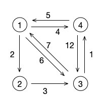

# 图的应用：最短路径

上篇文章的最小生成树有没有意犹未尽的感觉呀？不知道大家掌握得怎么样，是不是搞清楚了普里姆和克鲁斯卡尔这两种算法的原理了呢？面试的时候如果你写不出，至少得说出个大概来吧，当然，如果你是要考研的学生，那就要深入的理解并且记住整个算法的代码了。

## 什么是最短路径

今天我们学习的是图的应用中另外一个经典的问题，也就是 最短路径 的问题。这个问题和最小生成树是不同的，最小生成树的要求是要连通所有的结点，并且走得是权值最小的那条路线。而最短路径则是指的从某个顶点到另一个顶点中权值最小的那条路径。这条路径不一定是包含在最小生成树中的，所以它们并没有太大的联系。



从这张图来看，我们从结点 1 到结点 2 的最短路径是 2 ，这个很明显。那么从结点 1 到结点 3 呢？可不是直接的中间那个权值为 6 的路径，而是走 1->2->3 这条路径，也就是权值加起来为 5 的这条路径。

然后我们再来看结点 3 ，它到结点 1 最短路径应该是走 3->4->1 这条路径，也就是权值为 6 的这条路径，而不是中间的那条直线的权值为 7 的路径。

没错，这就是最短路径的概念了。在最短路径中，我们一般会解决单向图的问题，但实际生活中呢？最典型的地图相关的应用其实是都是双向图的。不过这并不影响我们的学习，我们可以把这个示例图中的结点看成是城市火车站点，就算是连接结点 1 和结点 3 的火车线路，也不一定来去的时间都是相同的。比如说从长沙到北京的 Z2 次火车全部运行时间为14小时42分，而回来的 Z1 次则是14小时10分。那么我们是否可以选择其它的火车，比如有趟火车从长沙到石家庄可能只需要8小时，然后从石家庄到北京只需要2小时，这样我们选择这条线路的总时间就只需要10小时了（当然，这只是例子，大家在非高铁的情况下肯定还是更多地会选择起始站的火车来坐）。

## 多源最短路径 Floyd 算法

首先，我们先说一个多源最短路径的算法。那么什么叫做多源呢？

其实就是这一个算法就能够得出所有结点到所有结点之间的最短路径。没错，就这一个算法，不管哪个结点到哪个结点，它们之间的最短路径都一次性算出来了。神奇吗？不不不，更神奇的，而且你一会就会叫出 Oh!My God! 的是它的核心代码，只有五行！！

```php
function Floyd($graphArr){
    $n = count($graphArr);
    
    for($k = 1;$k<=$n;$k++){ // 设 k 为经过的结点
        for($i = 1;$i<=$n;$i++){
            for($j = 1;$j<=$n;$j++){
                // 如果经过 k 结点 能使 i 到 j 的路径变短，那么将 i 到 j 之间的更新为通过 k 中转之后的结果 
                if($graphArr[$i][$j] > $graphArr[$i][$k] + $graphArr[$k][$j]){
                    $graphArr[$i][$j] = $graphArr[$i][$k] + $graphArr[$k][$j];
                }
            }
        }
    }

    for($i = 1;$i<=$n;$i++){
        for($j = 1;$j<=$n;$j++){
            echo $graphArr[$i][$j], ' ';
        }
        echo PHP_EOL;
    }
}
// 请输入结点数：4 
// 请输入边数：8
// 请输入边，格式为 出 入 权：1 2 2
// 请输入边，格式为 出 入 权：1 3 6
// 请输入边，格式为 出 入 权：1 4 4 
// 请输入边，格式为 出 入 权：2 3 3
// 请输入边，格式为 出 入 权：3 1 7
// 请输入边，格式为 出 入 权：3 4 1
// 请输入边，格式为 出 入 权：4 1 5
// 请输入边，格式为 出 入 权：4 3 12
// 0 2 5 4 
// 9 0 3 4 
// 6 8 0 1 
// 5 7 10 0 
```

我们可以先验证下结果，就是注释中最后输出的矩阵。结点 1 到结点 2、3、4的最短距离为 2 、5 、4 。结点 3 到结点 1 、2 、4 的最短距离为 6 、8 、1 。也就是说，原来的那个图的邻接矩阵成了这个最短路径的矩阵。每一行代表每个结点到其它结点的最短距离。

好吧，结果没问题，那么代码到底是写得啥玩意？这个 k 是什么？别急，我们一步一步来看。

- 假设两点之间的距离不是最短的，那么肯定是有另外一个点做为媒介进行跳转，由 i 点先跳到这个点然后再跳向 j 点，这样的一条路径是比直接的 i 到 j 要近的，我们就定义这个点为 k 点

- 但是我们不知道要走哪个结点呀，而且还有可能不只是一个 k ，或许我们从 i 到 j 要经历好多个 k ，这时候，我们就从 k 开始遍历，也就是第一层循环

- 在第一层循环下，进行我们正常的 i 和 j 的遍历循环，获得 i 直接到 j 的长度，也就是 [i][j] 。这时，由于有最外层的 k 存在，所以我们也知道了如果 i 从 k 走再从 k 到 j 的长度，也就是 [i][k] + [k][i] 这段距离

- 很明显，如果 [i][k] + [k][i] 的距离要比 [i][j] 短的话，更新 [i][j] 的值为 [i][k] + [k][i] 

- 内部的 i 和 j 循环完成后，第 1 个结点做为媒介跳转的遍历也完成了，当前的矩阵中各个结点之间的权重已经是经过第 1 个结点做为媒介之后的最短路径了

- 但是呢，这并不准确，说不定我们可能经过 i 、k1 、 k2 、 j 的路径才是最短的，所以外层的 k 循环继续遍历并将第 2 个结点作为媒介结点

- 循环往复直到所有结点都做过一次中间的媒介结点之后，我们就得到了一个最短路径的矩阵图，也就是我们上面测试代码中输出的结果

我们就拿结点 4 和结点 3 来说明。我们定义 4 为 i ，结点 3 为 j 。

初始化时，[i][j] 为 12 ，这个没什么问题，单向图的那条带箭头的边的权值就是 12 。

然后当 k 为 1 时，也就是我们经过结点 1 来看路径有没有变短，这时 [i][k] 是 5 ，[k][j] 是 6 ，OK，路径变成 11 了，把 [i][j] 的值改成 11 。

同时，在 i 为 4 ，j 为 2 的情况下，他们两个的最短路径也在这次 k=1 的循环中被赋值为 7 。最开始 4 到 2 是没有直接的边的，现在在结点 1 的连接下，他们有了路径，也就是 [4][2] = [4][1] + [1][2] = 7  。

当 k 为 2 时，[i][j] 为 11 ，这时 [i][k] 就是上面说过的 [4][2] 。也就是 7 ，而 [k][j] 则是 3 ，路径又缩小了，[i][k] + [k][j] = 10 ，[i][j] 现在又变成了 10 。

循环继续，但已经没有比这条路径更小的值了，所以最后 [4][2] 的最短路径就是 10 。

看着晕吗？拿出笔来在纸上或者本子上自己画画，每一步的 k 都去画一下当前的最短路径矩阵变成什么样了。这样画一次之后，马上就知道这个 Floyd 算法的核心奥秘所在了。

不得不说，前人的智慧真的很伟大吧，不过说是前人，其实 Floyd 大佬在 1962 年才发表了这个算法，但这个算法的核心思想却是数学中的动态规划的思想。所以说，算法和数学是没法分家的，各位大佬哪个不是数学界的一把手呢。

## 单源最短路径 Dijkstra 算法

说完了多源最短路径，我们再讲一个鼎鼎大名的单源最短路径的算法。虽说上面的多源很牛X，但是它的时间复杂度也就是时间效率也确实是太差了，没看错的话三个 N 次的循环嵌套就是 O(N<sup>3</sup>)。如果数据稍微多一点的话基本就可以从 Oh!My God! 变成 Oh!FxxK! 了。而且大多数情况下，我们的需求都会是固定的求从某一点到另一点的最短路径问题，也就是单源最短路径问题。这时，就可以使用这种效率稍微好一点的算法来快速地解决了。

```php
// origin 表示源点，也就是我们要看哪个结点到其它结点的最短路径
function Dijkstra($graphArr, $origin)
{
    $n = count($graphArr);
    $dis = []; // 记录最小值
    $book = []; // 记录结点是否访问过
    // 初始化源点到每个点的权值
    for ($i = 1; $i <= $n; $i++) {
        $dis[$i] = $graphArr[$origin][$i]; // 源点到其它点的默认权值
        $book[$i] = 0; // 所有结点都没访问过
    }

    $book[$origin] = 1; // 源点自身标记为已访问

    // 核心算法
    for ($i = 1; $i <= $n - 1; $i++) {
        $min = INFINITY;
        // 找到离目标结点最近的结点
        for ($j = 1; $j <= $n; $j++) {
            // 如果结点没有被访问过，并且当前结点的权值小于 min 值
            if ($book[$j] == 0 && $dis[$j] < $min) {
                $min = $dis[$j]; // min 修改为当前这个节点的路径值
                $u = $j; // 变量 u 变为当前这个结点
            }
            // 遍历完所有结点，u 就是最近的那个顶点
        }
        $book[$u] = 1; // 标记 u 为已访问
        for ($v = 1; $v <= $n; $v++) {
            // 如果 [u][v] 顶点小于无穷
            if ($graphArr[$u][$v] < INFINITY) {
                // 如果当前 dis[v] 中的权值大于 dis[u]+g[u][v]
                if ($dis[$v] > $dis[$u] + $graphArr[$u][$v]) {
                    // 将当前的 dis[v] 赋值为 dis[u]+g[u][v]
                    $dis[$v] = $dis[$u] + $graphArr[$u][$v];
                }
            }
        }
        // 最近的结点完成，继续下一个最近的结点
    }

    for ($i = 1; $i <= $n; $i++) {
        echo $dis[$i], PHP_EOL;
    }
}

// 请输入结点数：4 
// 请输入边数：8
// 请输入边，格式为 出 入 权：1 2 2
// 请输入边，格式为 出 入 权：1 3 6
// 请输入边，格式为 出 入 权：1 4 4 
// 请输入边，格式为 出 入 权：2 3 3
// 请输入边，格式为 出 入 权：3 1 7
// 请输入边，格式为 出 入 权：3 4 1
// 请输入边，格式为 出 入 权：4 1 5
// 请输入边，格式为 出 入 权：4 3 12

// 测试第四个结点到其它结点的最短路径
Dijkstra($graphArr, 4);
// 5
// 7
// 10
// 0
```

代码一下增加了不少吧，不过仔细看一下核心的算法部分，这次只是两层循环的嵌套了，时间复杂度一下子就降到了 O(N<sup>2</sup>) ，这一下就比 Floyd 算法提升了很多。当然，它的场景也是有限的，那就是只能一个结点一个结点的计算。

好了，我们还是来看一下 Dijkstra 到底在干嘛吧。我们依然是使用上面那个简单的图，并且还是研究结点 4 到其它结点的算法执行情况。

- 首先，我们初始化结点 4 到其他所有结点的默认值，这时结点 4 到结点 2 是没有直接路径的，所以是无穷大，而到结点 1 是 5，到结点 3 是 12 。

- 然后将结点 4 标记为已访问，也就是 book[4] = 1 

- 进入核心算法，从头开始遍历结点，这里是标记为 i 下标，因为这里是单源的最短路径，所以我们不需要再看自己到自己的最短路径了，只需要 n-1 次循环就可以了

- 开始 j 层的循环，先判断当前的结点是否已经被标记过，没有被标记过的话再看它的值是否是最小的，最后循环完成后获得一个从结点 4 出发的权值最小的路径，并将这条路径到达的结点下标记为 u ，标记 u 下标的这个结点为已访问结点

- 进入 v 循环，判断图中 u 到 v 的结点是否是无穷，如果不是的话再判断 u 到 v 的结点加上原来的 dis[u] 的权值是否小于 dis[v] 中记录的权值，如果比这个小的话，更新 dis[v] 为 u 到 v 的结点加上原来的 dis[u] 的权值

- 循环重复地进行比较完成算法

对于结点 4 来说，dis 经历了如下的变化：

- 首先，默认情况下 dis = [5, 9999999, 12, 0]

- 第一次循环后，结点1 完成查找，并在 v 的循环中发现了可以从结点1 到结点2  和结点3 而且比原来的值都要小 ，于是 dis = [5, 7, 11, 0]

- 第二次循环后，结点2 完成查找，这次循环发现从结点2 到结点3 的距离更短，于是 dis = [5, 7, 10, 0]

- 第三次循环后，结点3 完成查找，没有发现更短的路径，dis = [5, 7, 10, 0]

看明白了吗？不明白的话自己试试吧，不管是断点还是在中间输出一下 dis 和 book ，都能够帮助我们更好地理解这个算法的每一步是如何执行的。从代码中就可以看出来，这个 Dijkstra 算法的时间复杂度是 O(N<sup>2</sup>) ，这可比 Floyd 快了不少了吧。

## 总结

关于图的两种最典型的应用及算法就到这里结束了。当然，图的内容可远不止这些，比较典型的还是进度网络图等的算法，特别是做一些项目管理类的系统时会非常有用。当然，更高深的内容就要去研究《图论》了。这个可就远超我的水平了，希望有更多数学相关基础的同学能够继续深入研究。而我嘛，先去恶补下数学吧！！

测试代码：

[https://github.com/zhangyue0503/Data-structure-and-algorithm/blob/master/5.图/source/5.5图的应用：最短路径.php](https://github.com/zhangyue0503/Data-structure-and-algorithm/blob/master/5.图/source/5.5图的应用：最短路径.php)

参考文档：

《数据结构》第二版，严蔚敏

《数据结构》第二版，陈越

《数据结构高分笔记》2020版，天勤考研

《啊哈！算法》