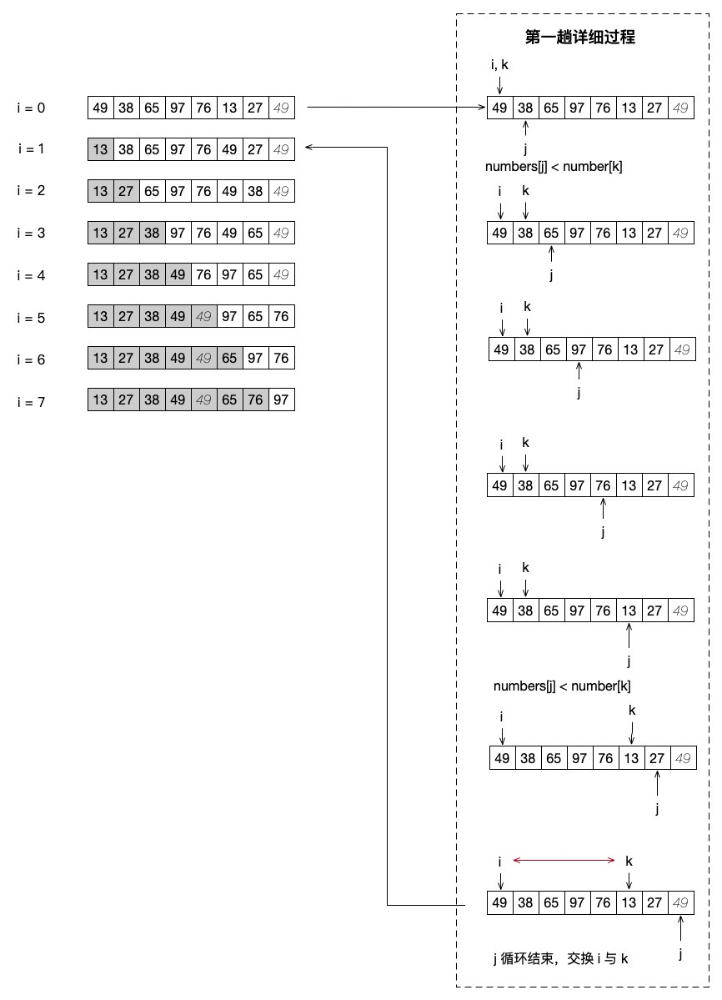
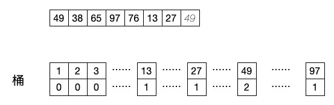

# 其它排序：简单选择、桶排序

这是我们算法正式文章系列的最后一篇文章了，关于排序的知识我们学习了很多常见的冒泡和快排，也学习过了不太常见的简单插入和希尔排序。既然今天这是最后一篇文章，也是排序相关的最后一篇，那我们就来轻松一些，再来学习两个非常简单的排序算法。

## 简单选择排序

首先是简单选择排序，它划分在了选择类排序下面，不过其实也可以看成是交换类的排序。因为它的核心代码中也是有交换操作的实现的。关于这个排序没有什么太多好说的，每次在遍历中找出最大或者最小的数据，然后将它放到相应的位置就可以了。我们先来看代码，然后再看图示的解析。

```php
function SelectSort($numbers){
    $n = count($numbers);
    for( $i = 0 ; $i < $n ; $i++){
        $k = $i;
        for( $j = $i+1 ; $j < $n ; $j++){
            if($numbers[$j] < $numbers[$k]){
                $k = $j;
            }
        }
        if($k != $i){
            list($numbers[$i], $numbers[$k]) = [$numbers[$k], $numbers[$i]];
        }
    }
    echo implode(', ', $numbers), PHP_EOL;
}
SelectSort($numbers);
// 13, 27, 38, 49, 49, 65, 76, 97
```

代码不复杂吧，可以注意到它也有交换代码的出现。我们使用的是上篇文章中的小彩蛋中的交换方式进行的数据位置的交换。它和冒泡以及快排那种专门的交换型排序算法的不同的，每次交换的 i 这个位置是不变的，什么意思呢？比如我们现在的 i 是 0 ，也就是说整个序列中最小的数据应该是要放在这个地方的。所以 j 循环是从 i + 1 的位置开始循环的，然后不停地和 i 这个位置的数据进行比较，并不断地更新 k （ k 在一开始是指定为 i 的）。找到最小的数据之后直接将这个数据和 i 的数据交换，这样最小的数据就放到了 i 的位置上了。这就是简单选择排序的核心思想。

这一大段说起来可能会看得比较懵圈。还是看看图吧！



我们依然还是以第一趟的详细过程为例。

- k = i ，然后 j 从第二个数据开始遍历

- 如果发现 numbers[j] 小于 numbers[k] 的数据，也就是更小的数据，就让 k = j

- j 循环遍历完成后，k 指向的下标就是最小那个数据，于是交换 k 和 i 的值

- 一趟排序下来，最小的数据就放到了最前面的位置了

是不是感觉和冒泡有点像呀？确实是很像，冒泡也是一趟外层循环就可以把某个最大或者最小的值放到正确的位置上。不过需要注意的是，冒泡是前后两个数据相比，很有可能每次比较都会发生交换。而选择排序则是以一个下标指针的位置移动来确定数据，最后也只进行一次交换。所以说，它是有选择性的交换，而不是纯粹的一路交换到底。

## 简单桶排序

其实真正的桶排序还是比较复杂的，而今天我们学习的这个简单的桶排序则是真的简单的不行。它体现的是一种以空间换时间的方式，具体是怎么换的呢？

```php
function BucketSort($numbers){
    $bucketList = [];
    $maxValue = max($numbers);
    for($i=0;$i <= $maxValue;$i++){
        $bucketList[$i] = 0;
    }
    foreach($numbers as $n){
        $bucketList[$n]++;
    }
    $sortList = [];
    foreach($bucketList as $k => $v){
        if($v > 0){
            for( ; $v > 0 ; $v--){
                $sortList[] = $k;
            }
        }
    }
    echo implode(', ', $sortList), PHP_EOL;
}
```

如果是针对的数字类型的排序操作，特别是这个数字基数不大，比如说是类型枚举之类的数据，我们都可以使用这种桶排序的方式。首先我们要看当前最大的数字是几，然后初始化一个数组到这个最大数字的下标，并将所有内容设置为 0 。然后遍历原始的排序数组，给这个要排序数据对应的值加 1 。于是，待排序序列所代表的那些键的值都会变成 1 ，同时，如果有相同的数据，我们使用的是 ++ 操作，这个数据对应的键值就会继续加 1 。具体的过程就如下图所示：



相信这个图已经说明得非常清晰了吧，也不需要我们再深入地解释了吧。这就是这种最简单的桶排序方式，我们也可以将这个桶数组的内容换成二维数据，这样我们就可以实现更复杂数据的排序操作了。不过还是要注意，一定是针对数字类型的哦。另外，我们的 PHP 还可以这样来写桶排序。

```php
function BucketSort2($numbers){
    $bucketList = [];
    foreach($numbers as $n){
        $bucketList[$n]++;
    }
    ksort($bucketList);
    $sortList = [];
    foreach($bucketList as $k => $v){
        for( ; $v > 0 ; $v--){
            $sortList[] = $k;
        }
    }
    echo implode(', ', $sortList), PHP_EOL;
}
BucketSort2($numbers);
// 13, 27, 38, 49, 49, 65, 76, 97
```

也就是利用 ksort() 来实现，当然，这就是借助语言的默认函数的排序算法了，毕竟我们是在学习阶段，还是要从上面那种写法来理解这个简单桶排序哦！

## 总结

今天的内容非常简单吧，简单选择其实也是一种交换排序，但它在大类中还是划归到了选择排序这个类型中。而桶排序是属于基数排序的一种。各种排序其实还有很多，但除了我们学习的这些之外，其它的都会更加的复杂也并不常见，大家有兴趣的可以在下期我们的总结文章中了解到有哪些可以继续深入学习的内容。精彩还有继续，不要错过哦！

测试代码：

参考文档：

《数据结构》第二版，严蔚敏

《数据结构》第二版，陈越

《啊哈！算法》